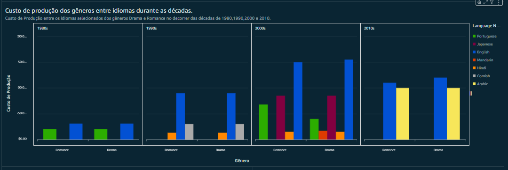
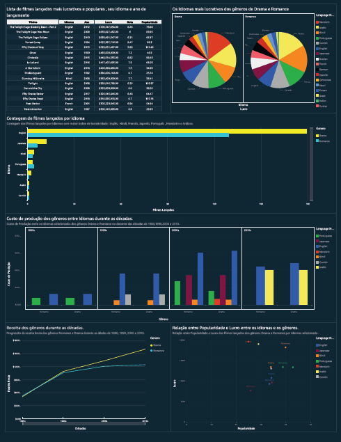

# **Sprint 10- AWS Quicksite e Dashboard** 

## **Sobre o Desafio:**

O desafio da Sprint 10 consistia na construção de um dashboard na AWS QUICKSITE, utilizando tabelas e gráficos dos dados ingeridos, armazenados e processados desde a sprint 6.

## **Dashboard**

O Tema do Dashboard é : **Análise da Lucratividade e Popularidade de Filmes de Drama e Romance em Diferentes Idiomas ao Longo das Décadas**

O Dashboard começa com uma tabela que contém os títulos principais dos filmes dos gêneros Drama e Romance do dataset, o idioma falado em cada um, o ano de lançamento, o lucro (custo menos a receita bruta), a nota e a popularidade. A tabela apresenta na primeira linha o filme com maior lucro dentro do dataset.

Observando os idiomas da tabela, notamos uma grande incidência de filmes em inglês, seguidos por filmes em hindi e depois em francês, e assim por diante. Comparando a coluna lucro com a coluna popularidade, percebe-se que os filmes com maior lucro não possuem os maiores índices de popularidade, quando comparados a filmes com menor lucro. Da mesma forma, ao comparar a coluna nota com a coluna lucro, percebe-se que os filmes com maior lucro não possuem as maiores notas dentro do dataset. A análise sugere que a popularidade e a qualidade percebida (nota) de um filme nem sempre estão diretamente relacionadas ao seu sucesso financeiro

Para verificar a incidência dos idiomas dos filmes presentes no dataset, foi elaborado um gráfico de pizza, separado por gênero, contendo os idiomas com maior índice de lucro em cada gênero.

O gráfico mostra os idiomas mais lucrativos nos gêneros Drama e Romance. Observa-se que no gênero Drama, os idiomas com maior índice são: Mandarim (15%), Árabe (14%), Hindi (10%), Português (10%), Cornish (10%), Inglês (8%) e Japonês (7%). No gênero Romance, os idiomas Árabe e Hindi aparecem com 16% cada, seguidos por Português (12%), Cornish (11%), Inglês (8%) e Japonês (7%).

Este gráfico reflete o crescimento do cinema asiático em termos de lucratividade. Embora o inglês apareça com uma fatia relevante, ela é menor em comparação ao mandarim, sugerindo uma diversidade maior de idiomas lucrativos no gênero. O gráfico destaca a importância do idioma como fator crucial para a lucratividade dos filmes em diferentes gêneros, refletindo tanto o alcance global quanto as forças dos mercados regionais.

A variedade de idiomas representada no gráfico sugere uma crescente diversidade na indústria, onde produções em línguas menos faladas começam a encontrar seu público, auxiliadas pelas plataformas de streaming e pela internet.

Focando nos idiomas com maior índice de lucro encontrados no gráfico de pizza, foi criado um gráfico que contabiliza distintamente os idiomas dos filmes existentes no dataset. 

O gráfico mostra a predominância do idioma inglês entre os filmes presentes no dataset, com 179 filmes de Drama e 129 de Romance lançados. O inglês é amplamente falado globalmente, o que lhe garante um mercado maior. Os outros idiomas selecionados possuem uma quantidade inferior de filmes, porém com um índice de lucro maior.

A coluna de lucro contém os valores da receita subtraídos do custo de produção. O gráfico ilustra como o custo de produção dos filmes dos gêneros Romance e Drama variou entre os idiomas selecionados ao longo das décadas de 1980, 1990, 2000 e 2010.

**Década de 1980**

Os custos de produção parecem baixos. O inglês predomina, refletindo sua relevância na produção global. Idiomas como o português apresentam custos baixos, devido à menor produção de filmes em comparação ao inglês. Nessa época, as produções dependiam de mídias tradicionais, como TV e cinema. O inglês prevalece devido à influência de Hollywood em outras indústrias de entretenimento.

**Década de 1990**

Nota-se um aumento considerável nos custos de produção, refletindo o início de uma expansão nas indústrias de mídia globalizadas. A internet surgiu nos anos 90, ainda inicial e limitada. Países como os Estados Unidos e alguns europeus começaram a explorar seu potencial para distribuição e marketing, fortalecendo ainda mais o domínio do inglês na indústria.

**Década de 2000**

Nesta década, observa-se um aumento significativo nos custos de produção, o mandarim e o japonês mostram uma forte presença, refletindo o aumento do poder econômico da China e do Japão, reflete o enorme mercado interno e suas políticas de incentivo à cultura local. O inglês ainda predomina, mas há maior diversidade nos custos, sugerindo a expansão da produção em outros mercados. O surgimento de plataformas online, após a popularização da internet, como YouTube, redes sociais e streaming, democratizou o acesso ao conteúdo. 

**Década de 2010**

Os custos de produção em inglês alcançaram níveis muito altos. A ascensão de plataformas como a Netflix, que investem em produções locais, contribuiu para o crescimento em outros idiomas. Hollywood manteve sua liderança devido à relevância em mercados globais.

A produção árabe tem forte inclinação por temas históricos, culturais e religiosos, mas ainda carece de grandes produções nos gêneros de Romance e Drama. O idioma tem mais de 400 milhões de falantes, mas tende a atender aos mercados locais e regionais, o que limita os custos das produções. Iniciativas culturais, como o "Red Sea International Film Festival" e o aumento da coprodução com estúdios internacionais, começaram a impulsionar o interesse por produções árabes.

Analisando o mercado bruto dos gêneros de Drama e Romance ao longo das décadas de 1980, 1990, 2000 e 2010.

**Década de 1980**

Ambos os gêneros começaram em situações semelhantes, porém o Romance era mais lucrativo do que o Drama nesta década. O gráfico reflete a natureza menos comercial destes gêneros, já que o cinema naquela epóca, era dominado por produções de ação e aventura de Hollywood.

**Década de 1990**

Nota-se um aumento significativo na receita bruta de ambos os gêneros. A década de 1990 marcou a globalização da indústria da sétima arte, com blockbusters e dramas de alta qualidade, como Titanic, lançado em 1997, que mesclava os dois gêneros com temas universais para alcançar maiores audiências.

**Década de 2000**

A receita dos dois gêneros continuou crescendo, mas o Drama prevaleceu sobre o Romance, consolidando-se como uma categoria premiada em festivais e premiações. Na época, o Romance começou a enfrentar concorrência de comédias românticas e outros subgêneros.

**Década de 2010**

O Drama continuou mostrando um crescimento contínuo e consistente, enquanto o Romance mostrou uma estabilização. Plataformas de streaming e o aumento da produção internacional ampliaram o alcance global dos Dramas. O público passou a preferir narrativas mais complexas e diversificadas. O gráfico reflete a adaptabilidade às novas demandas do público, enquanto o Romance precisou se reinventar em subgêneros para permanecer lucrativo.

Agora, vamos analisar a relação entre popularidade e lucro dos filmes presentes no dataset e os idiomas com maior índice de lucro.

O inglês domina tanto em popularidade quanto em lucro, com vários pontos espalhados por uma faixa superior no gráfico, destacando seu amplo mercado e capacidade de retorno financeiro. O mandarim indica o crescimento do mercado chinês e o potencial de filmes regionais alcançarem grandes lucros tanto no mercado doméstico quanto global, devido à globalização trazida pela internet. O mercado robusto de Bollywood gera bons retornos financeiros. As produções japonesas mostram popularidade e lucros moderados em comparação ao inglês ou mandarim, indicando um mercado sólido dentro e fora do Japão. O português reflete um mercado mais limitado ou menos exportado, com lucros mais baixos em comparação a outros idiomas. Filmes árabes apresentam dados de lucro e popularidade baixos, o que pode estar relacionado a um mercado mais restrito e de menor impacto global.

O gráfico reflete a importância do idioma para a performance financeira e a relação entre o apelo popular de um filme e seu potencial de bilheteria. A popularidade parece estar mais correlacionada com o idioma e o alcance do mercado do que com o gênero do filme. Idiomas amplamente falados, como inglês e mandarim, mostram como filmes em idiomas regionais enfrentam desafios para alcançar lucros significativos.

## **Conclusão**

A análise revela a importância crucial do idioma para o desempenho financeiro e o alcance de mercado dos filmes. O crescimento da diversidade linguística na indústria cinematográfica é impulsionado por plataformas de streaming e pela internet. A análise também mostra que a popularidade e a qualidade percebida de um filme nem sempre estão diretamente relacionadas ao seu sucesso financeiro, reforçando a ideia de que marketing eficaz e estudos aprofundados sobre o mercado, tanto global quanto regional, são essenciais para maximizar o desempenho dos filmes.

# **Dashboard completo**

