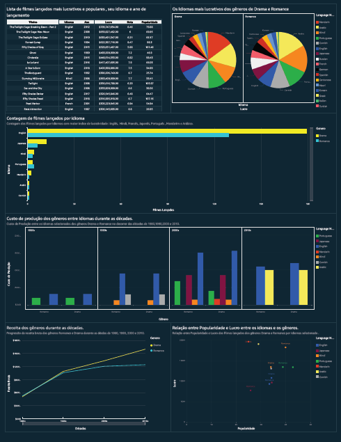

# **Sprint 10- AWS Quicksite e Dashboard** 

## **O que foi feito nessa Sprint 10?**

A sprint 10, sendo a ultima sprint do PB, consistia na construção de um dashboard, fazendo o uso do serviço da AWS QUICKSITE, usando os dados que foram trabalhando desde a sprint 6.

## **Tema do Dashboard**

O título do Dashboard é **"A Influência dos Idiomas na Lucratividade e Popularidade de Filmes de Drama e Romance: Uma Análise Década a Década"**

O dashboard oferece uma visão abrangente da indústria cinematográfica, identificando tendências de diferentes idiomas ao longo das décadas. Ele destaca o impacto do idioma e a influência da internet na receita, popularidade em filmes dos gêneros Drama e Romance.
Para ver as análises completas [click aqui.](Sprint_10/Desafio)

## **Exercícios**

Nesta sprint não houve exercícios.

## **Certificados**

Nessa sprint não houve cursos que requeriam certificados.

# **Comentário**

Concluir o programa de bolsas com a finalização deste dashboard foi uma verdadeira vitória. Envolveu muito aprendizado, superação e a valiosa ajuda dos monitores, do scrum master e da equipe técnica. Além disso, os colegas de turma e os membros do meu squad desempenharam um papel crucial no meu desenvolvimento durante o programa. Agradeço imensamente a todos que fizeram parte dessa jornada.