# **Sprint 5 - Computação em nuvem e Sistema AWS** 

## **O que foi feito nessa Sprint 5?**

Nessa Sprint 5 tivemos a intrudução aos sistemas AWS, usando o console como sistema de trabalho 

## **Exercicios**

O Laboratorío propostos nessa sprint consistiam na criação de um bucket do Amazon S3 que funcione como hospedagem de conteúdo estático.

**01.CRIAÇÃO DO BUCKET**

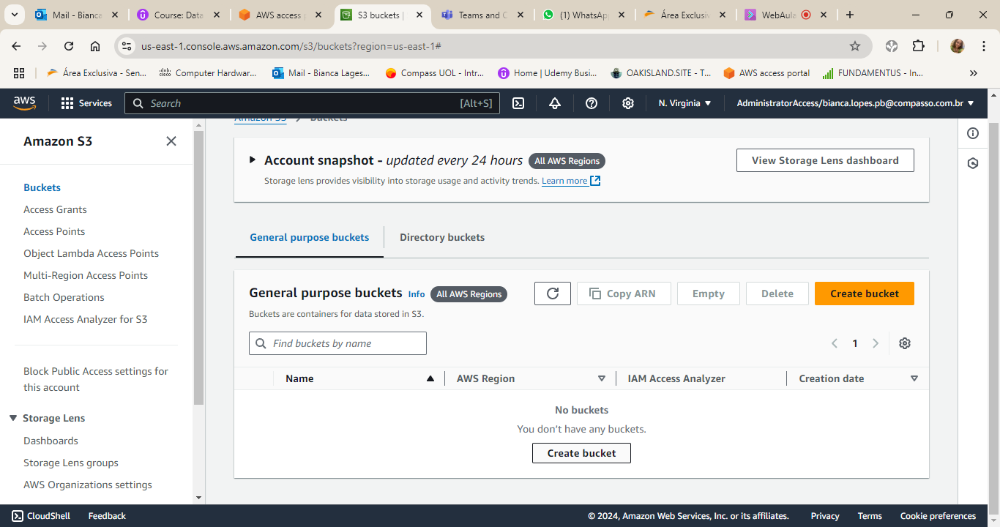

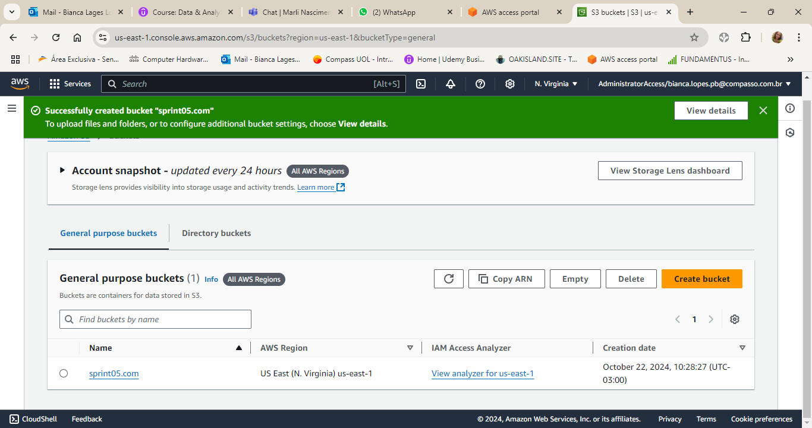

**02.HABILITAR HOSPEDAGEM DE SITE ESTÁTICO**

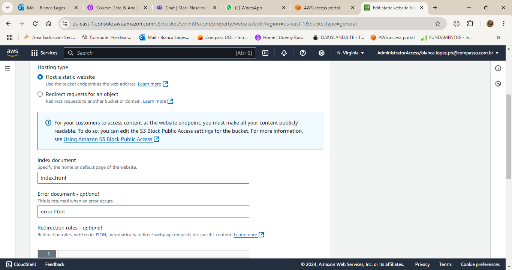

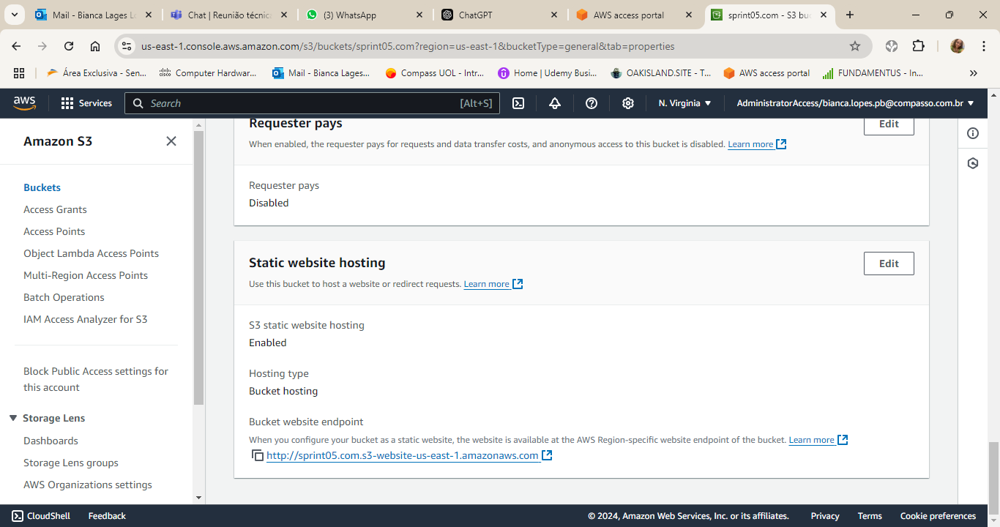

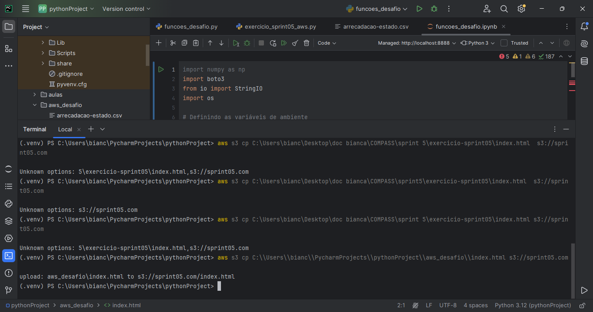

-Durante a execução do exercício houve um problema de permissão do provedor de internet, com isso o upload do arquivo index foi feito pelo terminal do Pycharm

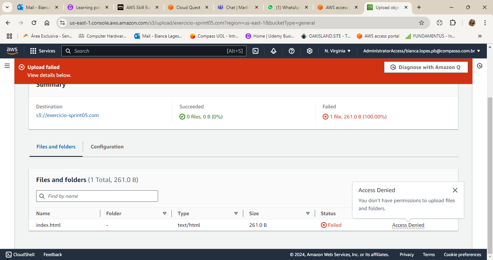

-Confirmação do arquivo index.html no bucket sprint05.com

Antes do Static Site Hosting

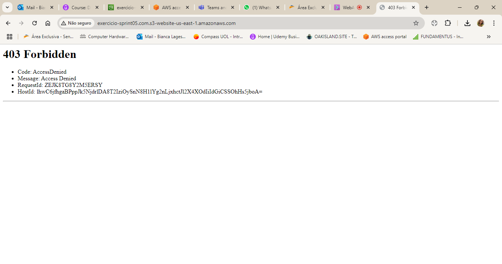

-Despois da Static Site Hosting

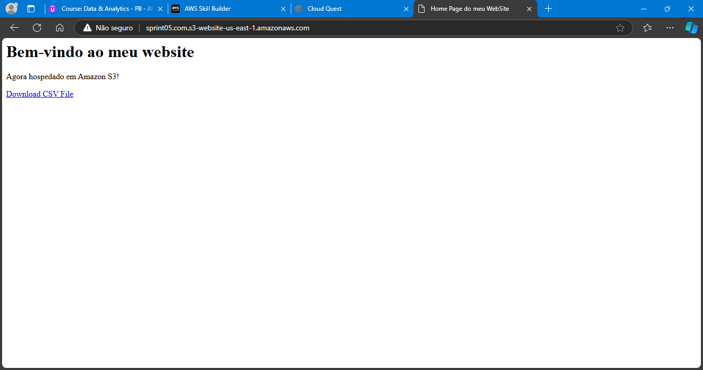

**03.EDITAR AS CONFIGURAÇÕES DO BLOQUEIO DE ACESSO PÚBLICO**

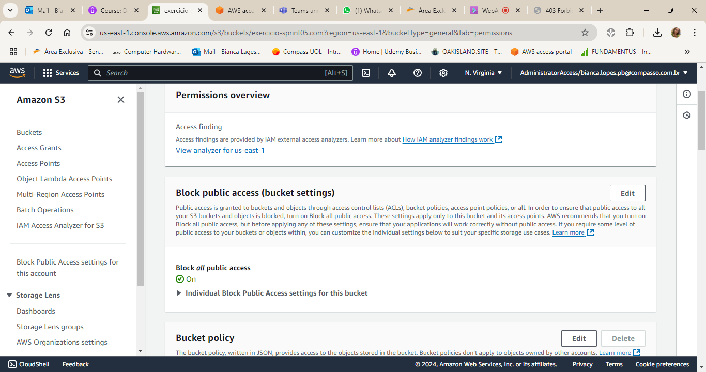

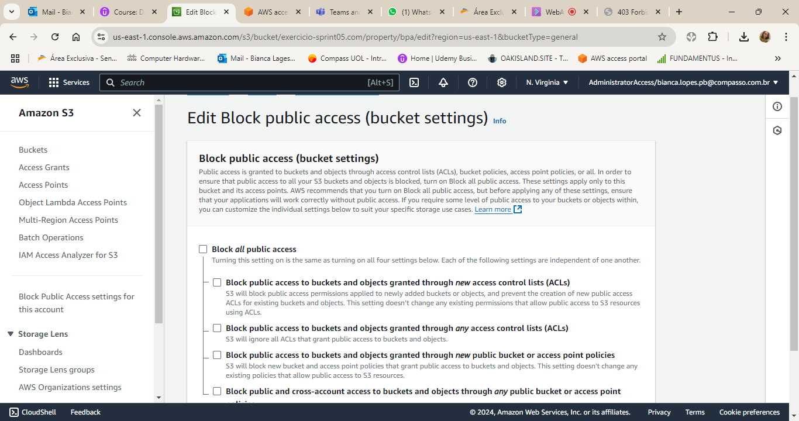

**04.ADICIONAR POLÍTICA DE BUCKET PARA CONTEÚDO DO BUCKET SEJA DISPONÍVEL PUBLICAMENTE**

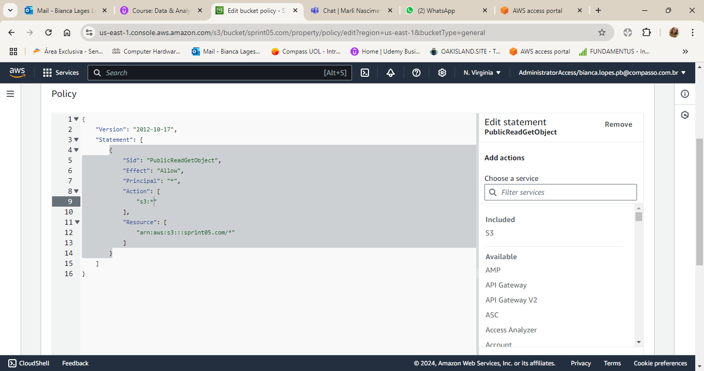

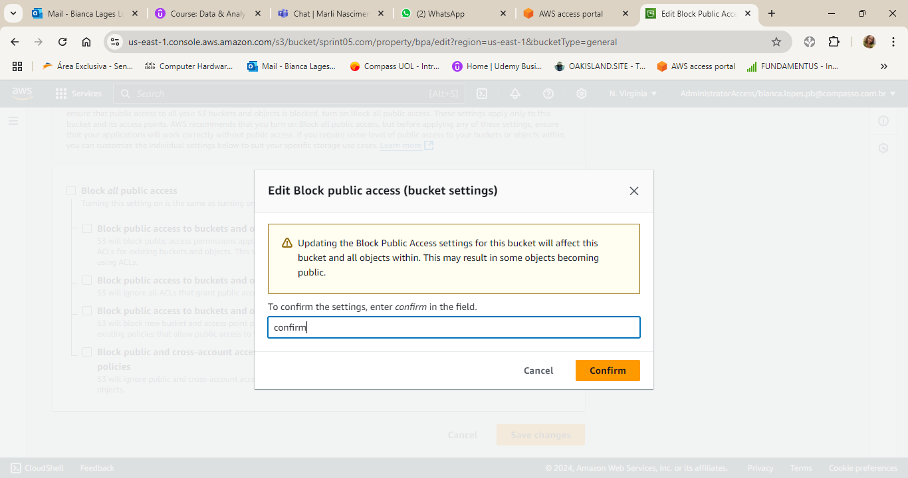

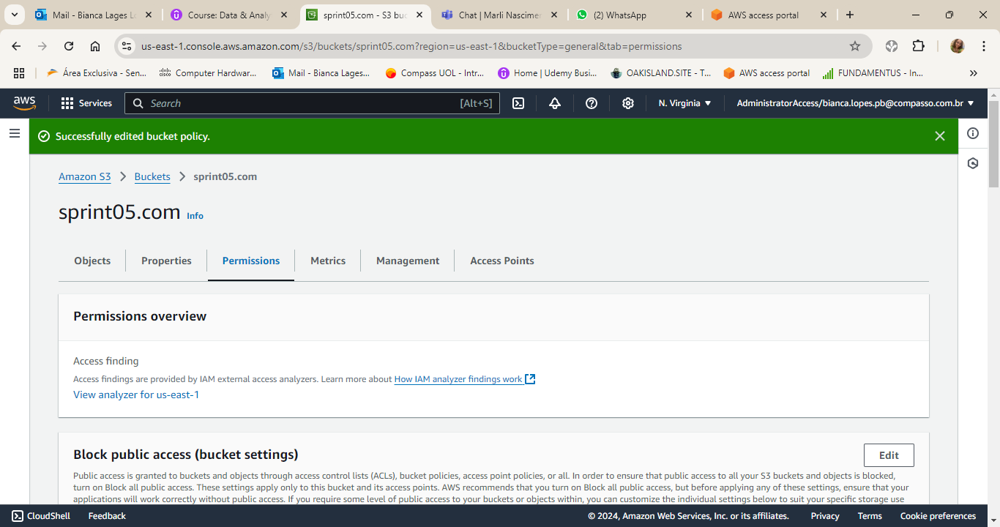

**05.UPLOAD DOCUMENTO CSV NO BUCKET**

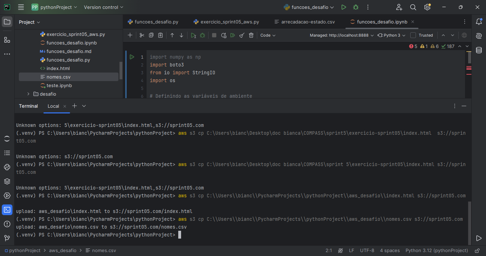

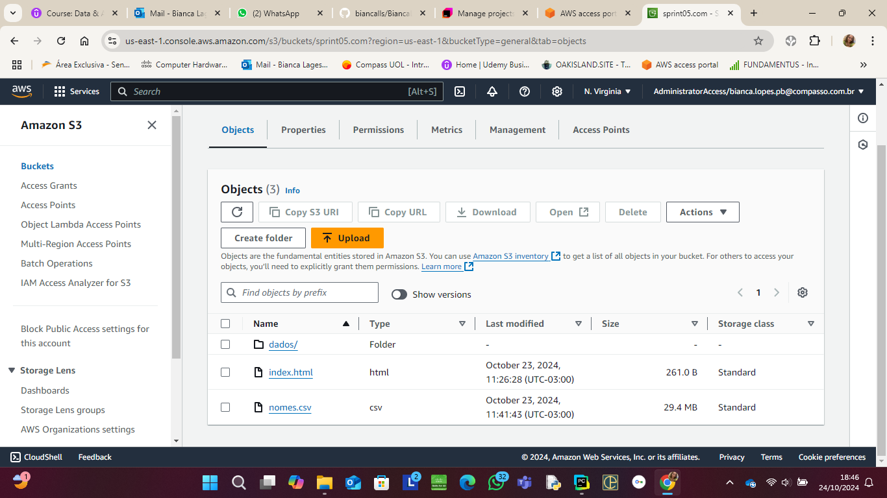

## **Certificados AWS**

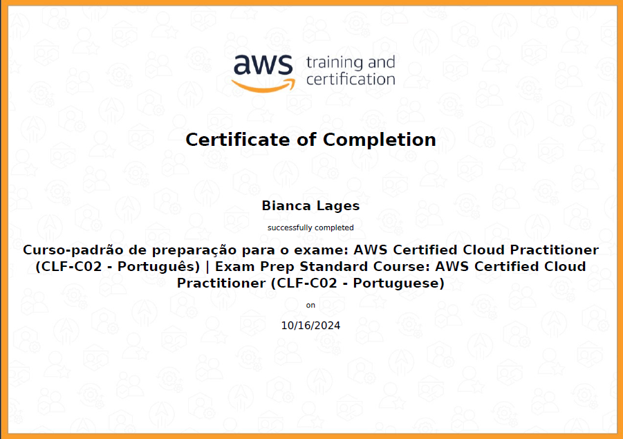

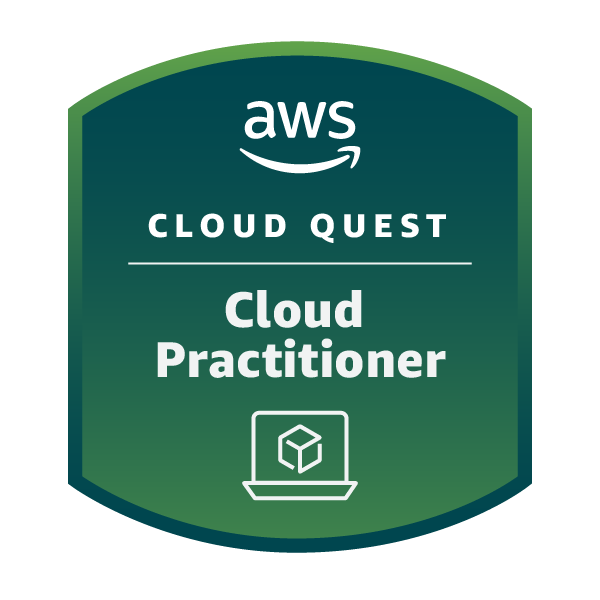

**Link público Credly**

https://www.credly.com/badges/79bd0ef8-3bd0-40f5-a2ac-2bb2fab656b2/public_url

## **Dificuldades**

Nessa Sprint a maior dificuldade que tive foi a conecção que tive que fazer com o sistema AWS, devido ao problema com as permissões do provedor de internet que dificultaram a execução do laboratório e desafio,foi feito pelo terminal do Pycharm usando um comando no terminal , até o mesmo o desafio, tive que colocar as acess key no documento porque pelo terminal o envio não estava dando o resultado querido. Contudo , tive ajuda do meus colegas de SQUAD e turma que ajudaram na execução das atividades. 
