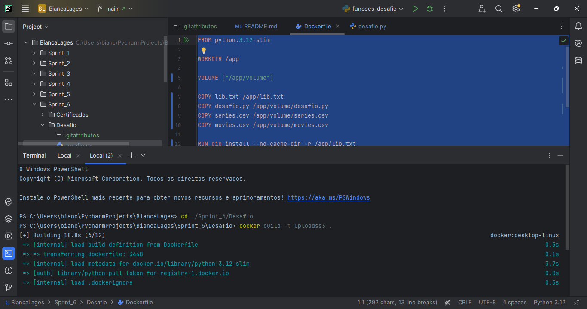
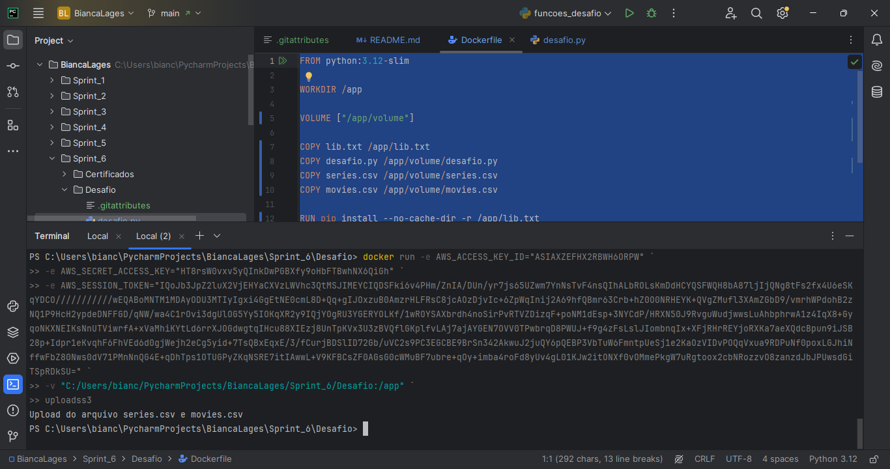
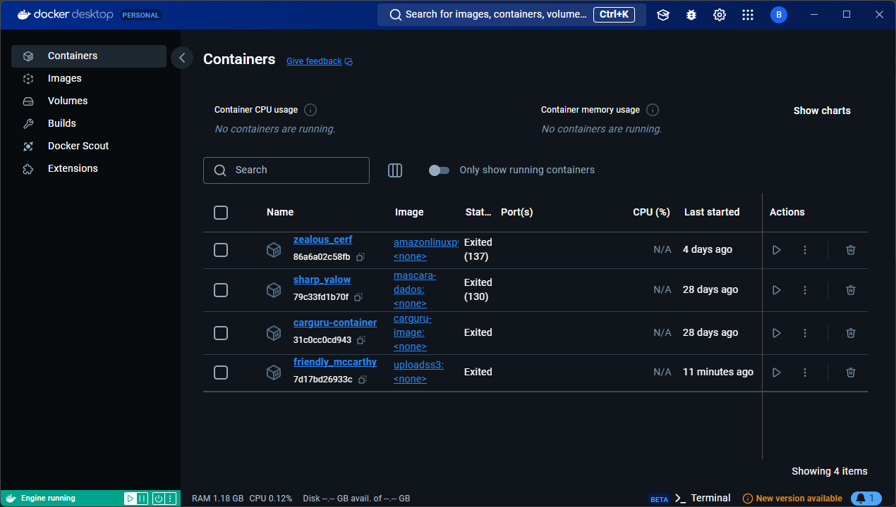
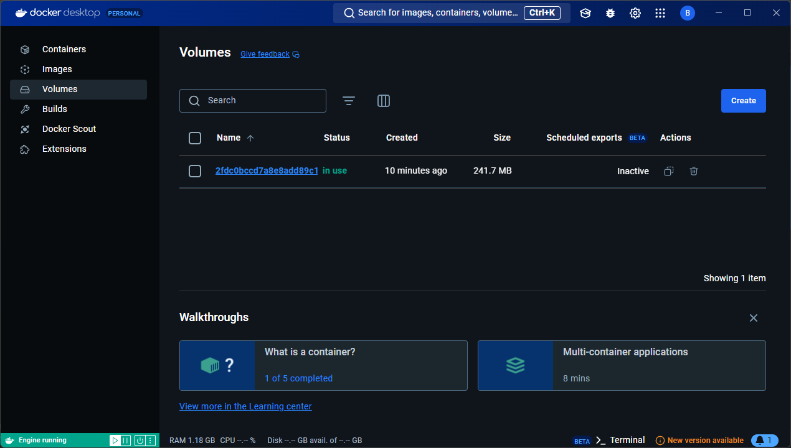
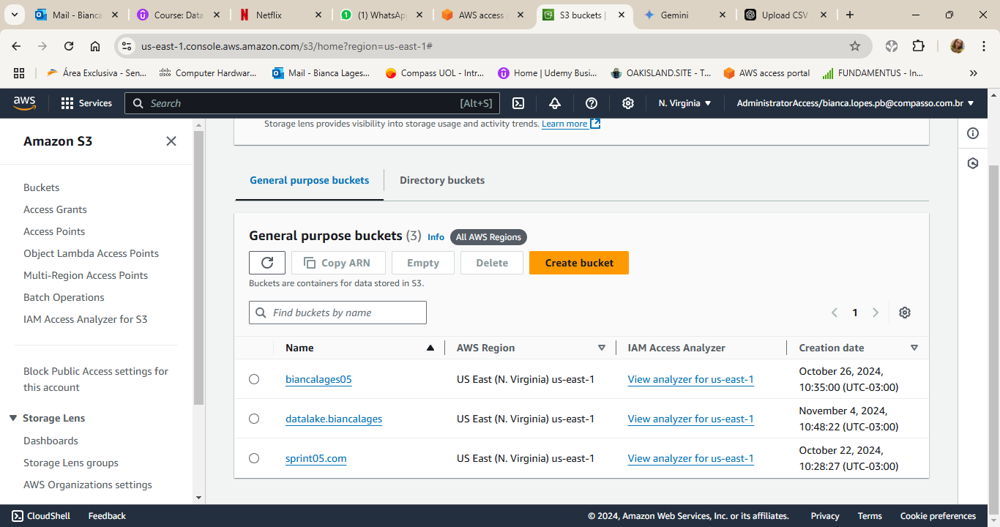
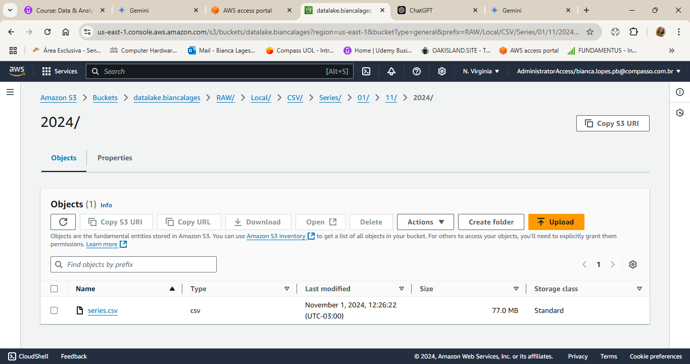
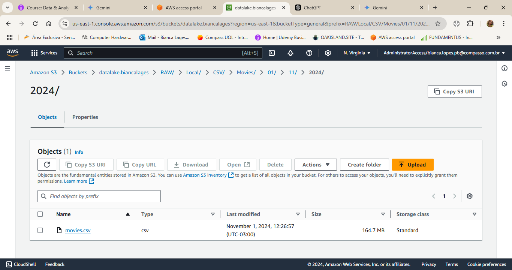

# **Sprint 6 - Dockerfile e Sistema AWS**

## **Sobre o Desafio:**

O objetivo do desafio dessa sprint era a prática combinada dos assuntos já visto até agora no Programa de Bolsas. Usei o programa Pycharm para realizar o desafio.

## **Etapas**

### **IMPLEMENTAR DADOS COM SCRIPT PYTHON**

````python

import boto3
from datetime import datetime
import os

````
Essas são as bibliotecas usadas para o código.

````python

s3 = session.resource('s3')

s3_client = session.client('s3')

nome_bucket = 'datalake.biancalages'

s3_client.create_bucket(Bucket=nome_bucket)


````

Começa a sessão do AWS e faz a criação do bucket de nome "datalake.biancalages".

````python

path_arq1= r"/app/series.csv"
path_arq2= r"/app/movies.csv"

nome_arq1 = r"series.csv"
nome_arq2 = r"movies.csv"

````
Identifica a localização do arquivo e o nomeia.

````python

data = datetime.now().strftime("%d/%m/%Y")

path_series = f"RAW/Local/CSV/Series/{data}/{nome_arq1}"
path_moveis = f"RAW/Local/CSV/Movies/{data}/{nome_arq2}"

s3_client.upload_file(path_arq1, nome_bucket, path_series)
s3_client.upload_file(path_arq2, nome_bucket, path_moveis)

````
A criação das pastas dentro do bucket "datalake.biancalages" no s3,com o path do arquivo como RAW/Local/CSV/Series/{data}/{nome_arq}.
em seguida faz o upload dos arquivos csv respectivamente.


### **DOCKERFILE COM VOLUME**

````dockerfile

FROM python:3.12-slim

WORKDIR /app

VOLUME ["/app/volume"]

````
Usando o slim para diminuir o tamanho dos arquivos, e a criação do volume.

````dockerfile

COPY lib.txt /app/lib.txt
COPY desafio.py /app/volume/desafio.py
COPY series.csv /app/volume/series.csv
COPY movies.csv /app/volume/movies.csv

````

Fazendo a copia dos arquivos de dentro do volume criado , o script python que faz o upload dos arquivos para o bucket que é criado dentro do script, os arquivos csv e o txt, para a instalação do boto3 dentro do bucket.

````dockerfile

RUN pip install --no-cache-dir -r /app/lib.txt

CMD ["python","/app/volume/desafio.py"]

````
Aqui faz o comando de instalação do lib.txt que contem "boto3" escrito dentro dele. o CMD para o tipo de código e o path do script python.

## **EXECUTANDO ARQUIVO DOCKERFILE**

**BUILD CONTAINER**



**RUN CONTAINER**



**CONTAINER**



**IMAGEM**


**VOLUME**



**BUCKET S3**



**DIRETÓRIO SERIES**



**DIRETÓRIO MOVIES**



# **ANÁLISE INICIAL DO DATALAKE**

Como os dados estão incompletos, nessa análise inicial surgiu os seguintes questionamentos.

## **1-Há uma relação entre custos da produção de um filme e as premiações recebidas?**

## **2-Qual atror/atriz tem maior rendimento, ou seja, premiações em filmes de drama do que em romance?**


# **Dificuldades**

As dificuldade que tive nesse desafio foi as questões de dificuldade com a connectividade da AWS com Pycharm , teve que colocar as chaves de acesso dentro do código python para conseguir fazer o upload dos arquivos csv para o bucket dentro do S3. Com a ajuda da minha SQUAD e dos pessoa da minha turma tive sucesso na execução do desafio. 


