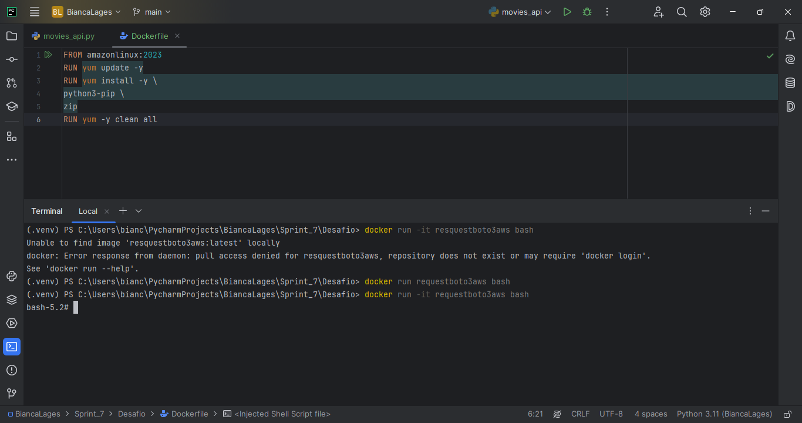
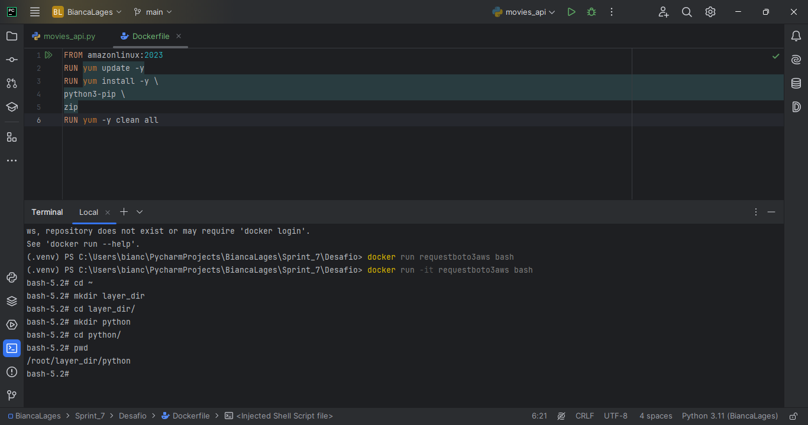
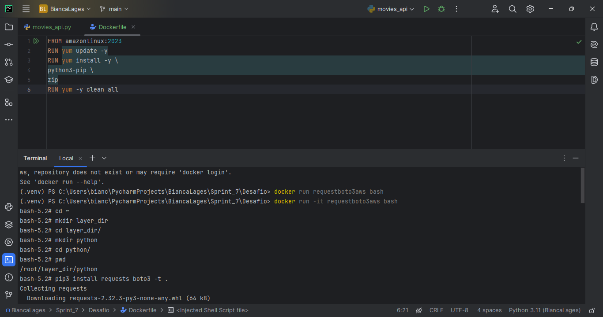
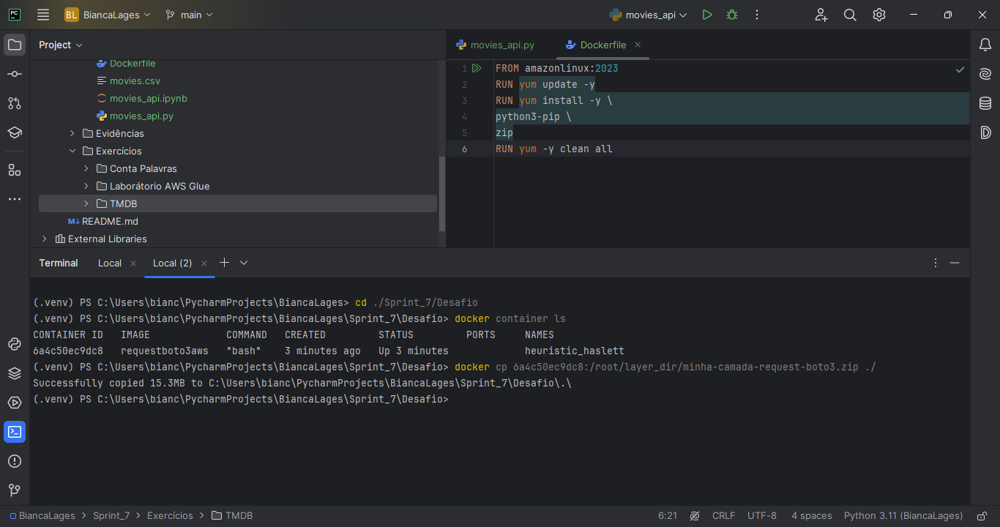
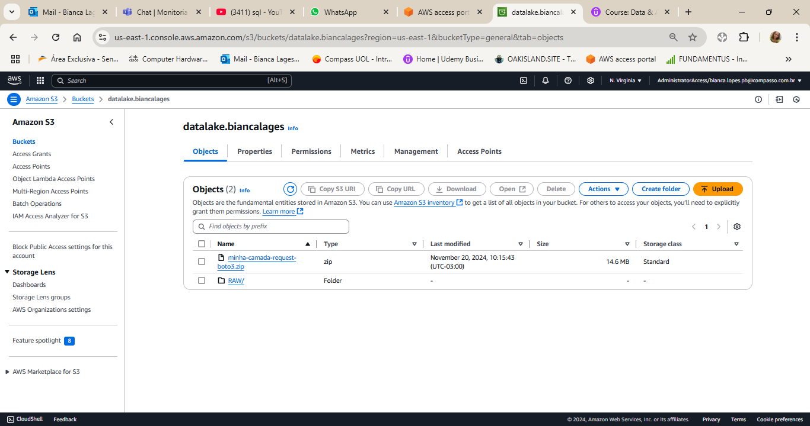
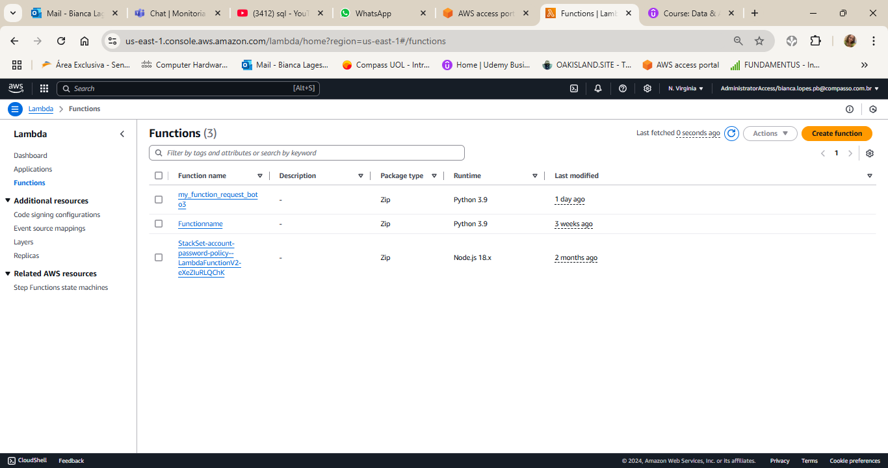
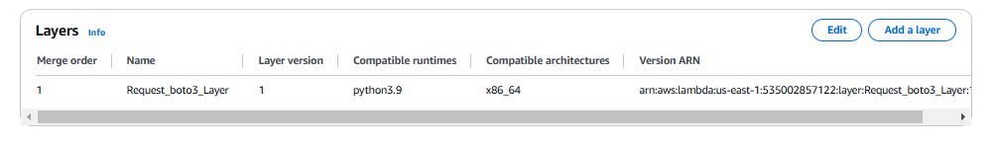
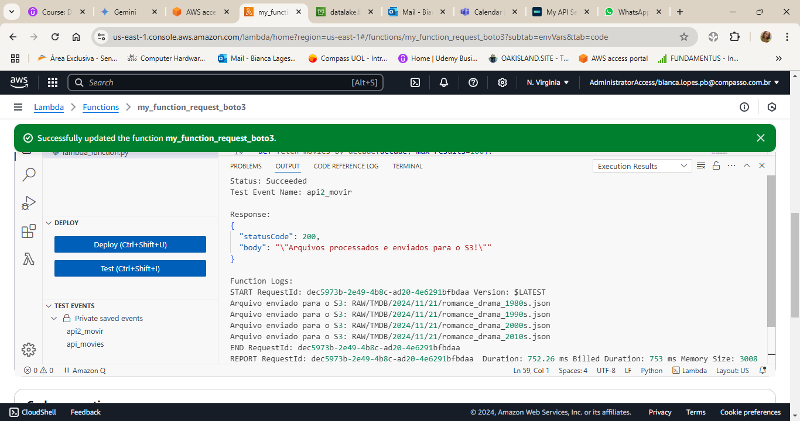
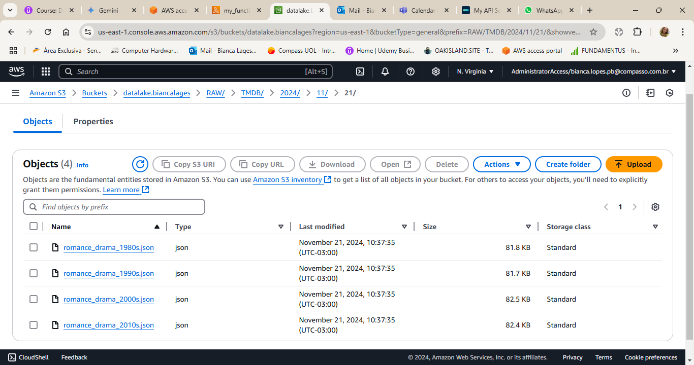

# **Sprint 7 - Sistema AWS e TMDB**

## **Sobre o Desafio:**

A captação dos dados filmes do TMDB via AWS Lambda , para a camada RAW Zone, mandando o arquivos em JSON , agrupando os arquivos com no maximo 100 registros.

## **Etapas**

### **Mandando o request e boto3 para o bucket desafio**

Usando o passo a passo dado para uso da AWS Lambda na sprint 6,usando um arquivo dockerfile para enviar o request e boto3 para o bucket do desafio "datalake.biancalages".

````dockerfile

FROM amazonlinux:2023
RUN yum update -y
RUN yum install -y \
python3-pip \
zip
RUN yum -y clean all

````

**DOCKER BUILD**


**DOCKER RUN BASH**



**Layer_dir**



**Install requests e boto3**



**Arquivo Zip**



**Bucket**



## **AWS LAMBDA**

Dentro do AWS Lambda, criamos a function e layer resquest e boto3.

**FUNCTION**



**LAYER**



**SCRIPT PYTHON**

````python
import json
import boto3
import requests
import os
from datetime import datetime
````
As bibliotecas usadas dentro do script no Lambda.

````python

# Configurações da API TMDb
API_KEY = os.getenv("TMDB_KEY")
BASE_URL = "https://api.themoviedb.org/3"
GENRES = [18, 10749]  # Drama e Romance
MIN_RATING = 5.0
DECADES = [1980, 1990, 2000, 2010]

````
Aqui temos as configurações de chave API, criei uma variável de ambiente para guardar a chave API para não o deixar visível dentro no script, filtrando pelos gêneros de romance e drama e outro filtro básico para pegar somente filmes com nota igual os maior que 5.0, e as decadas de 80,90,2000,2010.

````python

# Configurações do AWS S3
S3_BUCKET = "datalake.biancalages"
S3_PREFIX = "RAW/TMDB"
````
Aqui identificamos o bucket e as pastas que serão enviados os json.

````python

# Função para buscar filmes por década
def fetch_movies_by_decade(decade, max_results=100):
    """Busca filmes de Romance ou Drama por década com nota >= 5.0."""
    movies = []
    start_year = decade
    end_year = start_year + 9
    page = 1

    while len(movies) < max_results:
        url = f"{BASE_URL}/discover/movie"
        params = {
            "api_key": API_KEY,
            "with_genres": ",".join(map(str, GENRES)),
            "primary_release_date.gte": f"{start_year}-01-01",
            "primary_release_date.lte": f"{end_year}-12-31",
            "vote_average.gte": MIN_RATING,
            "page": page,
        }
        response = requests.get(url, params=params)
        if response.status_code != 200:
            print(f"Erro na requisição para década {decade}: {response.json()}")
            break

        data = response.json()
        results = data.get("results", [])
        movies.extend(results)
        page += 1
        if page > data["total_pages"]:
            break

        if len(movies) >= max_results:
            break

    return movies[:max_results]

````
Criei uma função que seleciona os filmes com nota maior ou igual a 5.0, por decada e com maximo de 100 registros por decada.

````python
# Função para salvar JSON no S3
def upload_to_s3(data, filename):
    """Faz upload de um arquivo JSON para o bucket S3."""
    s3_client = boto3.client('s3')
    date_str = datetime.now().strftime("%Y/%m/%d")
    s3_key = f"{S3_PREFIX}/{date_str}/{filename}"

    # Converte os dados para JSON
    json_data = json.dumps(data, ensure_ascii=False, indent=4)
    try:
        s3_client.put_object(
            Bucket=S3_BUCKET,
            Key=s3_key,
            Body=json_data,
            ContentType="application/json"
        )
        print(f"Arquivo enviado para o S3: {s3_key}")
    except Exception as e:
        print(f"Erro ao enviar {filename} para o S3: {str(e)}")
````

Agora salvando os arquivos json criados, usando o boto3, para o bucket, dentro da pasta RAW, criando uma pasta chamada TMDB e depois a data do upload de ano, mês e dia.

````python
# Função principal para AWS Lambda
def lambda_handler(event, context):
    """Função principal para rodar no AWS Lambda."""
    for decade in DECADES:
        movies = fetch_movies_by_decade(decade)
        filename = f"romance_drama_{decade}s.json"
        upload_to_s3(movies, filename)

    return {
        "statusCode": 200,
        "body": json.dumps("Arquivos processados e enviados para o S3!")
    }

````
Essa parte faz a separação das decadas por arquivos json, e o upload destes dentro do bucket "datalake.biancalages"

**Run do script**



**Arquivos JSON dentro do bucket**



# **Dificuldades**

As dificuldades que tive nesse desafio foram: o uso o script dentro do Lambda, os dados gerados pelo TMDB para satisfazer as analises das proximas sprints, como são dados RAW, os filtros foram bem básicos para depois fazermos a análises necessárias. 


