# **Sprint 7- AWS GLUE , PYSPARK E TMDB** 

## **O que foi feito nessa Sprint 7?**

Durante essa sprint foi introduzido ao Pyspark, o uso do TMDB e um laboratório do serviço AWS Glue.

## **Exercícios**

### **Conta Palavras**

Usando o PySpark para fazer a contagem das palavras do arquivo ReadME da sprint 01.

````python

from pyspark.sql import SparkSession
from pyspark.sql.functions import explode, split, length, col

````
Bivliotecas necessárias para usar o pyspark.

````python

spark = SparkSession.builder.appName("WordCount").getOrCreate()

````
Iniciando a sessão pyspark.

````python

readme_df = spark.read.text("../../Sprint_1/Desafio/README.md")
````

Leitura do arquivo Readme, sprint 01.

````python

#Filtro e contagem de palavras do arquivo README
words = readme_df.select(explode(split(col("value"),"\\s+")).alias("word"))
filtro_words = words.filter(length(col("word")) > 3)
words_count = filtro_words.groupBy("word").count()
words_count = words_count.orderBy(col("count").desc())

````
Filtrando e contando as palavras com mais de 3 letras.

````python

#Mostra a tabela de contagem de palavras
words_count.show()

#Encerra a sessão Pyspark
spark.stop()
````
Mostrando a tabela com a contagem e encerrando a sessão Pyspark.

**Resultado**

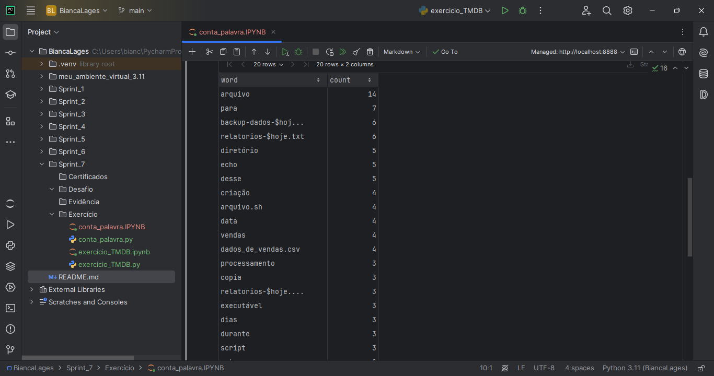

### **TMDB**

Com a criação do perfil no site TMDB, recebe-se uma chave API. 


**Resultado**

Usando o script dado no learning path tem-se o seguinte resultado.

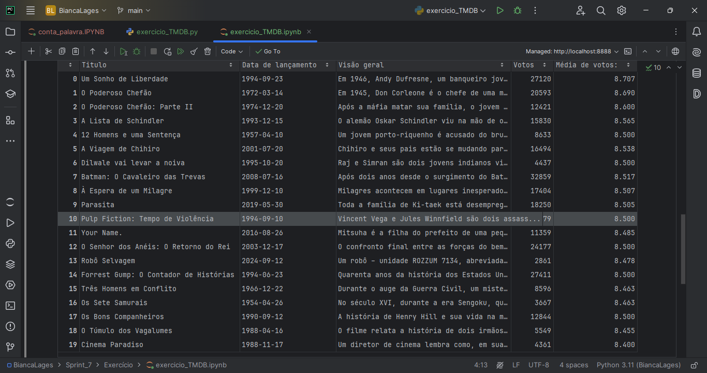

### **Laboratório AWS Glue**

**IAM ROLE**

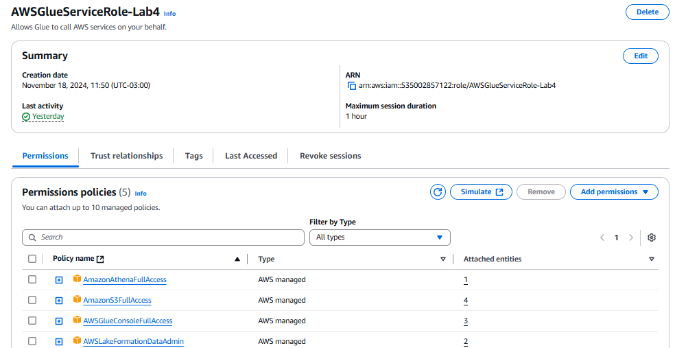

**Databeses**

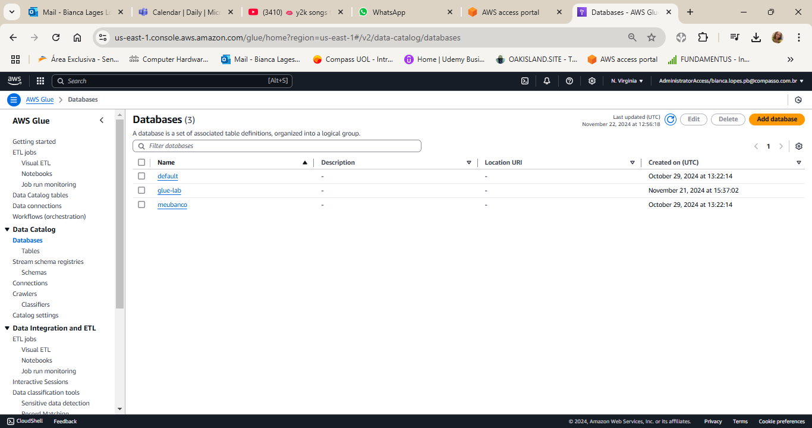

**JOB**

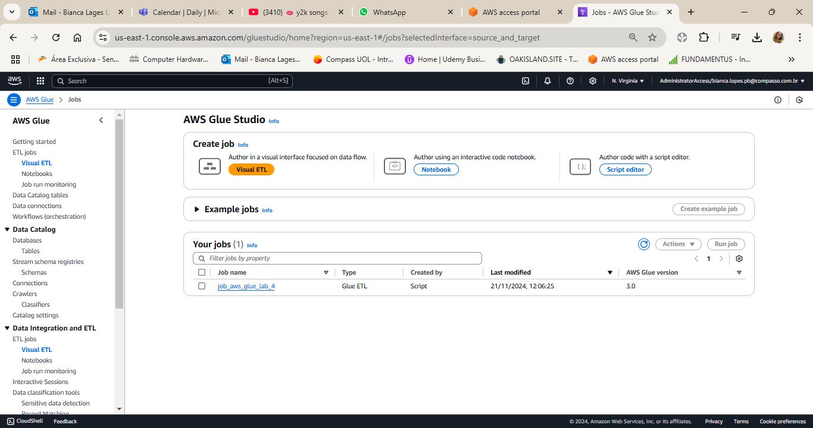

**Script Job**

Foram dados vários tópicos dentro do arquivo pdf que foi colocado dentro do script do Job.

````python
from pyspark.context import SparkContext
from pyspark.sql.functions import col, upper, desc, max as spark_max, count
````
Bibliotacas adicionais para uso do spark no job.

````python
df = spark.read.csv(source_file, header=True, inferSchema=True)
````
Leitura do arquivo nomes.csv.

````python

## @params: [JOB_NAME]
args = getResolvedOptions(sys.argv, ['JOB_NAME', 'S3_INPUT_PATH', 'S3_TARGET_PATH'])

````
Parâmetros criados para path do arquivo de origem e a pasta para salvar os resultados.

````python

df.printSchema()

````
Mostra o schema criado baseado no arquivo nomes.csv.

````python

df_upper = df.withColumn("nome", upper(col("nome")))
````
Tranforma coluna nome para maiúsculo.

````python

linhas_countagem = df_upper.count()
print(f"Contagem de linhas: {linhas_countagem}")
````
Contagem do numero de linhas. 

````python

df_grouped = df_upper.groupBy("ano", "sexo").agg(count("nome").alias("contagem_nomes"))
````
Contar nomes agrupados por "ano" e "sexo"

````python

df_sorted = df_grouped.orderBy(desc("ano"))
df_sorted.show()
````
Ordenar pelos anos mais recentes.

````python

feminino_mais_frequente = df_upper.filter(col("sexo") == "F") \
    .groupBy("nome", "ano").agg(spark_max("total").alias("max_frequencia")) \
    .orderBy(desc("max_frequencia")) \
    .first()
````
Nome feminino mais frequente.

````python

masculino_mais_frequente = df_upper.filter(col("sexo") == "M") \
    .groupBy("nome", "ano").agg(spark_max("total").alias("max_frequencia")) \
    .orderBy(desc("max_frequencia")) \
    .first()

print(f"Nome feminino mais frequente: {feminino_mais_frequente['nome']}, Ano: {feminino_mais_frequente['ano']}")
print(f"Nome masculino mais frequente: {masculino_mais_frequente['nome']}, Ano: {masculino_mais_frequente['ano']}")
````
Nome masculino mais frequente e print do resultado.

````python

total_por_ano = df_upper.groupBy("ano", "sexo").agg(count("nome").alias("total_registros"))
total_por_ano_sorted = total_por_ano.orderBy("ano").limit(10)
total_por_ano_sorted.show()
````
Total de registros por ano.

````python

target_path = "s3://sprint05.com/lab-glue/frequencia_registro_nomes_eua"
````
Caminho de saída no S3.

````python

df_upper.write.mode("overwrite") \
    .partitionBy("sexo", "ano") \
    .json(target_path)
````
Escrever no S3 em formato JSON com particionamento por "sexo" e "ano".

**Resultado JOB Run**

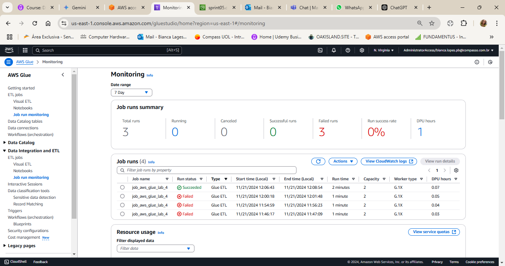

**Frequencia_nomes_UA no bucket**


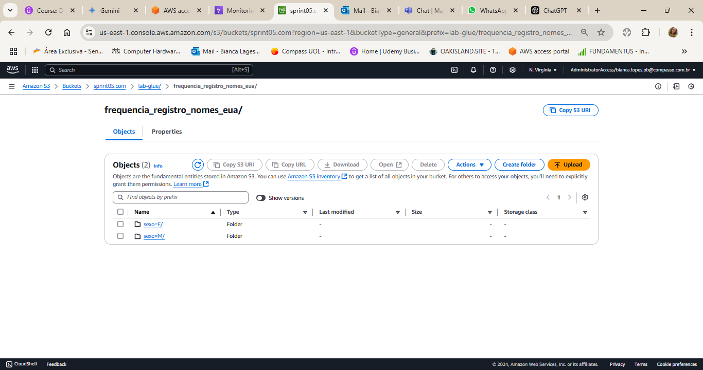

**CRAWLER**

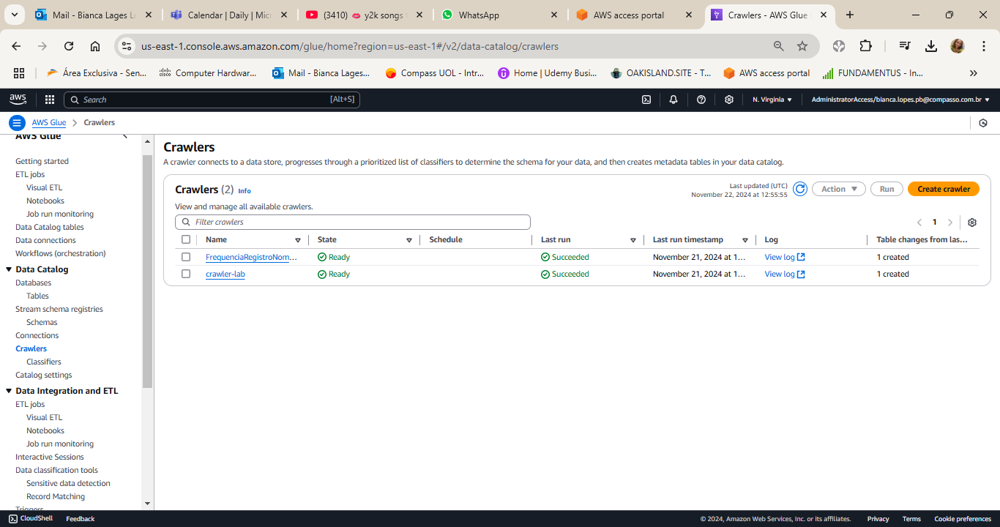

**QUERIES ATHENA**

Usando os arquivos criados,foi criado uma tabela , no AWS Athena dele foram feitas umas series de queries.

**TABELA ATHENA**

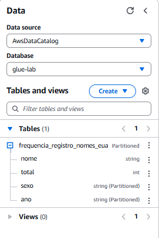

**Query 01**

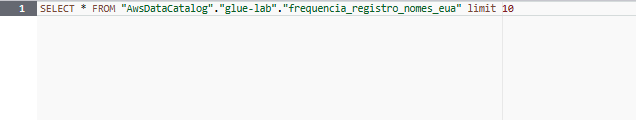

Contagem total de linhas.

**Resultado query 01**

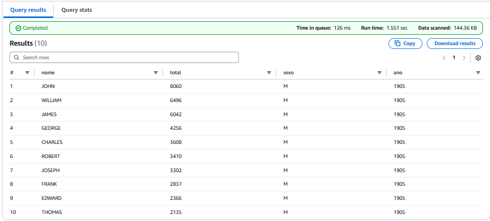

**Query 02**

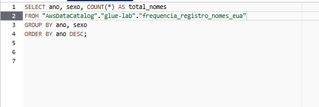

Contagem de nomes por ano e sexo.

**Resultado query 02**

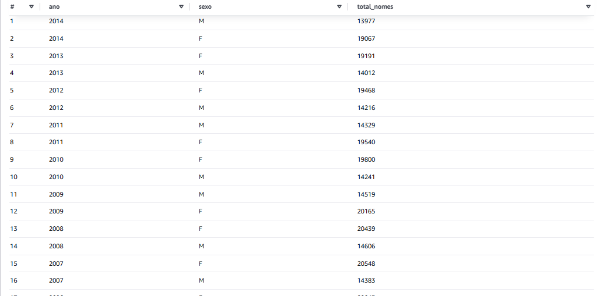

**Query 03**

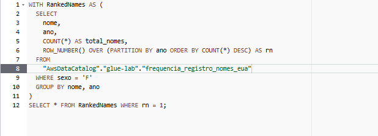

Nome feminino mais frequente.

**Resultado query 03**

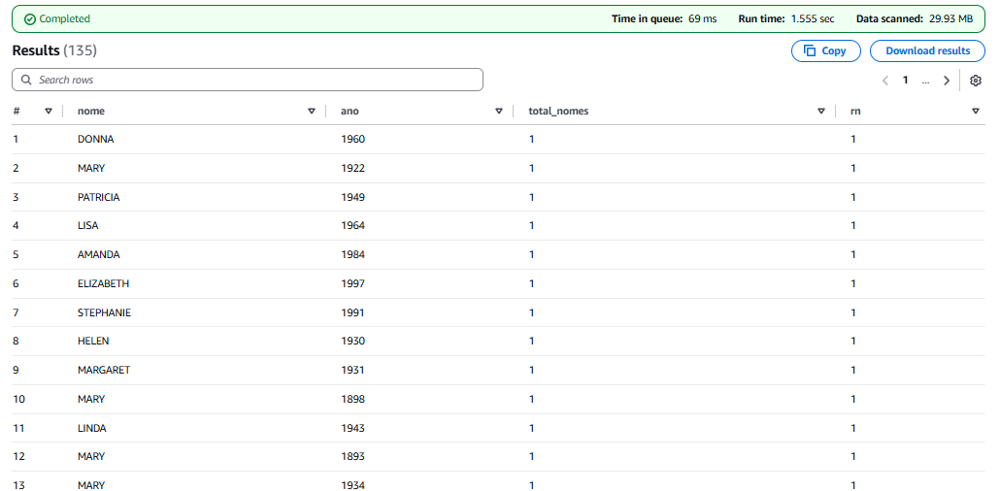

**Query 04**

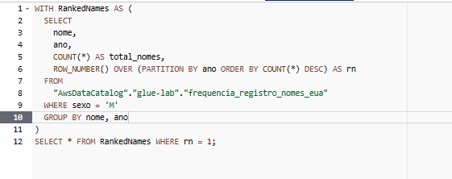

Nome masculino mais frequente

**Resultado query 04**

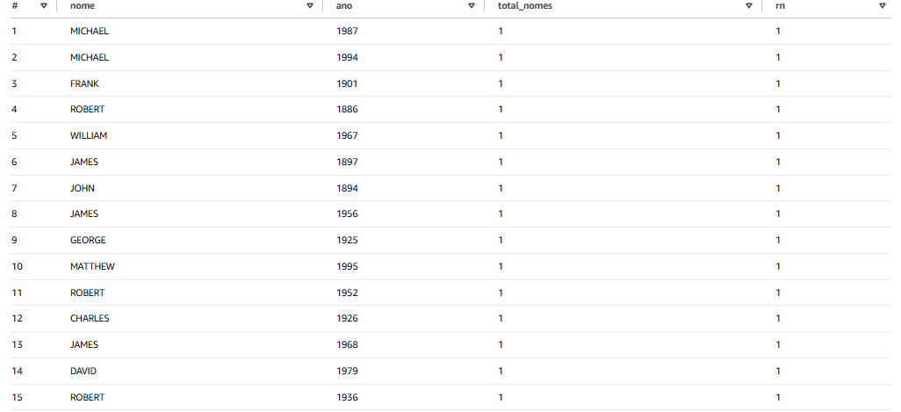

**Query 05**

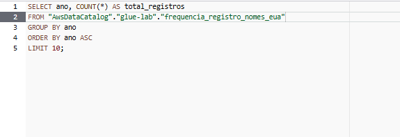

Total de registros por ano (primeiros 10)

**Resultado query 05**

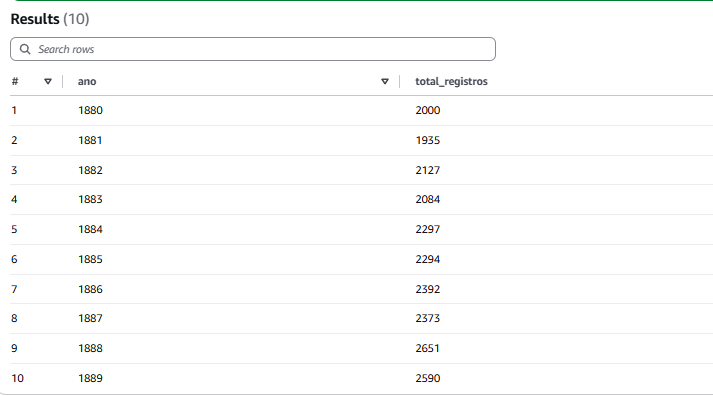

# **Certificado**

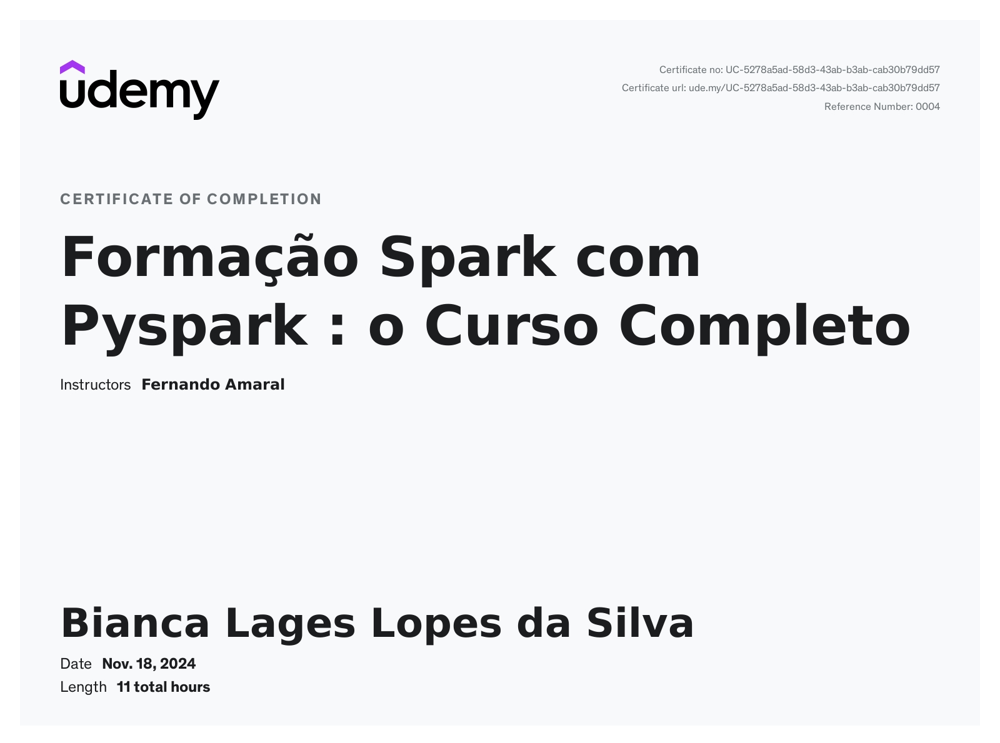

# **Dificuldades**

As dificuldades que tive durante essa sprint foram: fazer o pyspark funcionar na minha maquina, tive que desistalar o pyhton 3.12 que usava para a versão 3.11, pois é mais compativel com as bibliotecas spark, configurações de variaveis de ambiente para o java e o hadoop também foram necessarias para que o spark funcionasse na maquina que uso. A outra dificuldade foi no laboratório AWS Glue, pois como as instruções dados pelo pdf disponibilizados estavam desatualizadas tive dificuldade em fazer o job run corretamente, o que afetava o resto do laboratório. Porém foi feito a correção e com a ajuda da turma e do pessoal da minha SQUAD tive sucesso na conclusão dos exercícios e desafio.