# **Sprint 8 - Camada Trusted**

## **Sobre o Desafio:**

O desafio da Sprint 8 consistia no processamento da camada trusted, refinando os dados vindo do csv e json, deixando-os limpos e confiáveis, padronizando os resultados. Usando o Pyspark para o processamento, mandando os resultados para a Trusted Zone, usando os serviços disponíveis na AWS Glue e acessível via AWS Athena. Os dados persistidos na Trusted no formato PARQUET.

## **Correção dados API- AWS LAMBDA**

Durante a execução do desafio da Sprint 07, os dados resultantes do script mostraram-se insuficientes para apoiar as análises futuras e a normalização. Como resultado, aumentando a coleta de dados provenientes do TMDB. Mantendo os mesmos filtros (filmes com nota igual ou superior a 5.0 e décadas: 1980, 1990, 2000 e 2010), obtive 100 registros por década.

````python
# Configurações da API TMDb
API_KEY = os.getenv("TMDB_KEY")
BASE_URL = "https://api.themoviedb.org/3"
GENRE_NAMES = ["Drama", "Romance"]
MIN_RATING = 5.0
DECADES = [1980, 1990, 2000, 2010]
````
A primeira diferença é na identificação do gênero, a captação anterior usava o código id de gênero 18(Drama), 10749(Romance), desta vez é usado o nome do gênero: Drama e Romance, para que gere uma coluna string e duranta a normalização dos dados uma tabela mais adequada as análises seja feita.

````python
    detailed_movies = []
    for movie in movies[:max_results]:
        movie_id = movie["id"]
        detail_url = f"{BASE_URL}/movie/{movie_id}"
        detail_params = {
            "api_key": API_KEY,
            "language": "en-US"
        }
        detail_response = requests.get(detail_url, params=detail_params)
        if detail_response.status_code == 200:
            detailed_movies.append(detail_response.json())
        else:
            detailed_movies.append(movie)  # Adiciona dados básicos se a requisição detalhada falhar

    return detailed_movies
````
A segunda diferença é essa sessão que expande a captação, incluindo budget, revenue, origin country, production company entre outros, agregando mais dados para as ánalises.

## **AWS GLUE**

### **JOB RUN CSV** 

O script a seguir, lida com os dados contido no movies.csv. Fazendo uma padronização básica. 

````python
from pyspark.sql.functions import current_timestamp, date_format, col, lit
from datetime import datetime
from pyspark.sql.types import StructType, StructField, StringType, IntegerType, FloatType
````
Foram adicionadas as importação acima ao modelo de job disponibilizado.

````python
csv_path = "s3://datalake.biancalages/RAW/Local/CSV/Movies/11/11/2024/movies.csv"
trusted_path = 's3://datalake.biancalages/TRUSTED/CSV/'
````
Expõe o path do arquivo csv e o path do diretório trusted dentro do bucket "datalake.biancalages".

````python
schema = StructType([
    StructField("id", StringType(), True),
    StructField("tituloPincipal", StringType(), True),
    StructField("tituloOriginal", StringType(), True),
    StructField("anoLancamento", IntegerType(), True),
    StructField("tempoMinutos", IntegerType(), True),
    StructField("genero", StringType(), True),
    StructField("notaMedia", FloatType(), True),
    StructField("numeroVotos", IntegerType(), True),
    StructField("generoArtista", StringType(), True),
    StructField("personagem", StringType(), True),
    StructField("nomeArtista", StringType(), True),
    StructField("anoNascimento", IntegerType(), True),
    StructField("anoFalecimento", IntegerType(), True),
    StructField("profissao", StringType(), True),
    StructField("titulosMaisConhecidos", StringType(), True)
])
````
Descreve o schema para as colunas presente no csv, usando como modelo para leitura dos dados.

````python
df = spark.read.format('csv').option('header', 'true').option('delimiter', '|').schema(schema).load(csv_path)
````
Faz a leitura usando o spark do arquivo com formato csv, com cabeçalho, tendo o delimitador "|", usando o schema descrito e o path do movies.csv.

````python
df = df.dropDuplicates(['tituloOriginal'])
````
Retirando linhas duplicadas identificando, a coluna tituloOriginal como parâmetro.

````python
df = df.drop('generoArtista', 'personagem', 'anoNascimento', 'anoFalecimento', 'profissao')
````
Retirando colunas que não serão utilizadas do dataset.

````python
year = datetime.now().strftime('%Y')
month = datetime.now().strftime('%m')
day = datetime.now().strftime('%d')

trusted_zone_path = f'{trusted_path}{year}/{month}/{day}/'
````
Como serão criadas pastas seguindo data de processamento, aqui se gera strings para o caminho de saída com base na data de processamento. Expõe o path do arquivo parquet para o diretório Trusted / CSV, seguindo pelas pastas a data.

````python
df.write.mode('overwrite').parquet(trusted_zone_path)
````
Grava os dados usando o schema no bucket no formato PARQUET.

#### **RESULTADO**

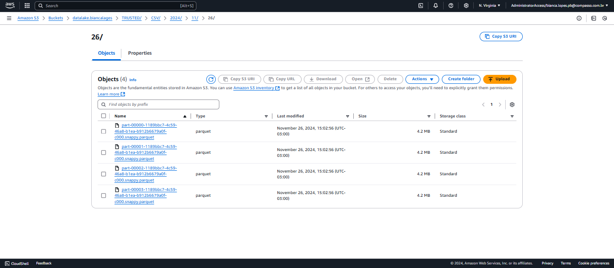

### **JOB RUN JSON**

````python
from datetime import datetime
from pyspark.sql.functions import col, to_date, when, explode
from awsglue.dynamicframe import DynamicFrame
````
Foram adicionadas as importação acima ao modelo de job disponibilizado, datatime para a criação do path dos parquet gerados, funções spark para tratamento de dados, conversões necessárias e lidar com os array presentes no json.

````python
json_path = "s3://datalake.biancalages/RAW/TMDB/2024/12/06/"
trusted_path = "s3://datalake.biancalages/TRUSTED/JSON/"
````
Expôe o path dentro do bucket "datalake.biancalages" da localização dos arquivos json e o prefixo para destino dos PARQUET dentro do bucket.

````python
print(f"Lendo dados JSON do caminho: {json_path}")
dyf = glueContext.create_dynamic_frame.from_options(
    connection_type="s3",
    connection_options={"paths": [json_path]},
    format="json"
)
````
Leitura do arquivo usando o Dynamicframe, usando spark para fazer essa leitura inicial, os dados vinha todos nulos. Então, foi encontrada essa solução da propria AWS chamado DynamicFrame.

````python
df = dyf.toDF()
````
Convertendo o DynamicFrame para DataFrame.

````python
df = df.withColumn("release_date", to_date(col("release_date"), "yyyy-MM-dd"))
````
Convertendo a coluna release_date de string para date.

````python
df = df.drop("overview", "poster_path", "tagline", "homepage", "runtime", "production_companies", "status", "video", "adult", "belongs_to_collection", "production_countries", "origin_country")
````
Retirando colunas desnecessárias.

````python
df = df.withColumn("budget", when(col("budget") == 0, None).otherwise(col("budget")))
````
Convertendo os "0", presentes na coluna budget , para nulo em vez de 0, pois em algumas analises, podendo-se assumir que o filme custou 0,00 em vez de significar que essa coluna está vazia, causando analises com dados errados.

````python
df = df.withColumn("revenue_int", when(col("revenue.int") == 0, None).otherwise(col("revenue.int")))
df = df.withColumn("revenue_long", when(col("revenue.long") == 0, None).otherwise(col("revenue.long")))
df = df.drop("revenue")
````
Convertendo os "0", presentes na coluna revenue.int e revenue.log, para nulo em vez de 0, pois em algumas analises, podendo-se assumir que o filme custou 0,00 em vez de significar que essa coluna está vazia, causando analises com dados errados. Alem de ajustar a estrutura para melhor uso futuro da coluna.

````python
# Explodir o array de gêneros
df = df.withColumn("genre", explode("genres"))
df = df.withColumn("genre_id", col("genre.id"))
df = df.withColumn("genre_name", col("genre.name"))
df = df.drop("genres", "genre")

# Explodir o array de idiomas falados
df = df.withColumn("spoken_language", explode("spoken_languages"))
df = df.withColumn("language_id", col("spoken_language.iso_639_1"))
df = df.withColumn("language_name", col("spoken_language.english_name"))
df = df.drop("spoken_languages", "spoken_language")

````
Explode os arrays de genres e spoken_languages, criando colunas adicionais genre_id, genre_name, language_id, e language_name.

````python
dyf_transformed = DynamicFrame.fromDF(df, glueContext, "dyf_transformed")
````
Transformando o DataFrame em DynamicFrame para a conversão para PARQUET.

````python
year = datetime.now().strftime('%Y')
month = datetime.now().strftime('%m')
day = datetime.now().strftime('%d')

output_path = f'{trusted_path}{year}/{month}/{day}/'
````
Como serão criadas pastas seguindo data de processamento, aqui se gera strings para o caminho de saída com base na data de processamento. Expõe o path do arquivo parquet para o diretório Trusted / CSV, seguindo pelas pastas a data.

````python
# Escrever os dados na camada Trusted em formato PARQUET
glueContext.write_dynamic_frame.from_options(
    frame=dyf_transformed,
    connection_type="s3",
    connection_options={"path": output_path},
    format="parquet"
)
````
Escreve os dados na camada Trusted em formato PARQUET.

#### **Resultado**


### **CRAWLER**

Usando os parquet gerados, foi feito um databases contendo os dados dos parquet vindo do csv e do json, porém um crawler para cada job feito, fazendo uma tabela para parquet vindo do csv e outro para o json.

**Database**


**Crawler**

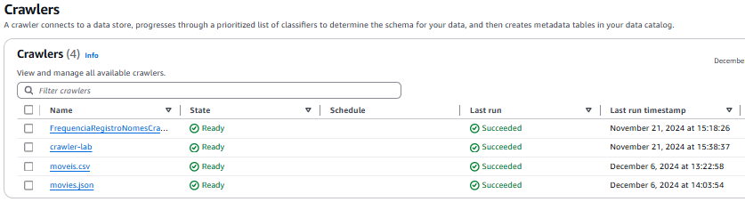

## **AWS ATHENA**

Depois do Run Crawler que resultou em duas tabela diferente, dentro de um database, seguimos para o AWS Athena e no console é visto a seguinte especificações de tabela e database utlizado no momento.

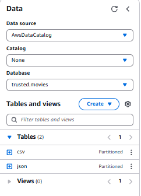
 
### **Queries Teste Tabelas**

Para testar os schemas feitos e a linguagem SQL conseguiria prover dados padronizados.Aqui mostra os 10 primeiros filmes de Drama e Romance, de cada tabela.

**QUERY 01-CSV**

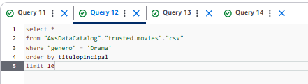

**RESULTA DO QUERY 01-CSV**

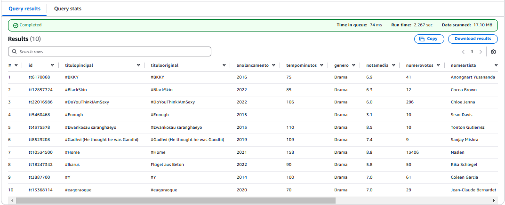

**QUERY 02-CSV**

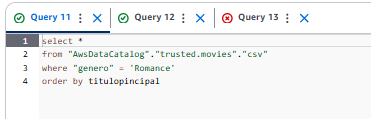

**RESULTADO**

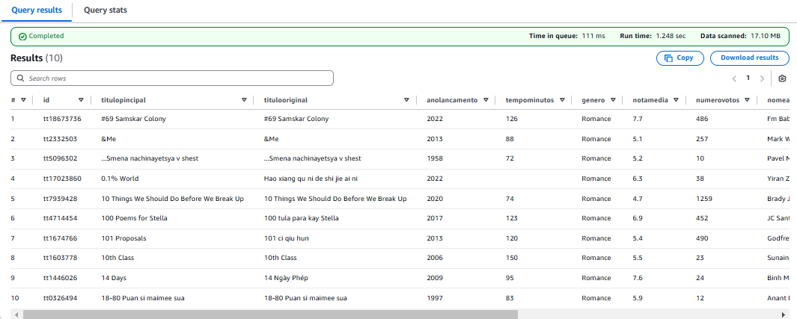

**QUERY 01-JSON**

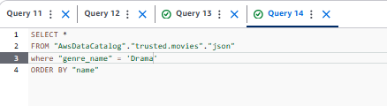

**RESULTADO**

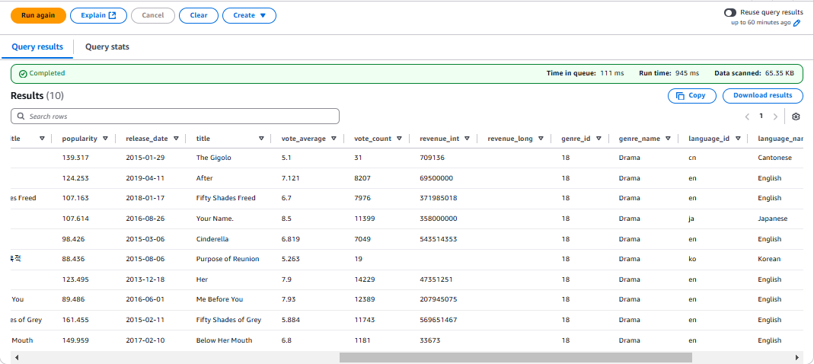

**QUERY 02-JSON**

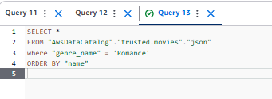

**RESULTADO**

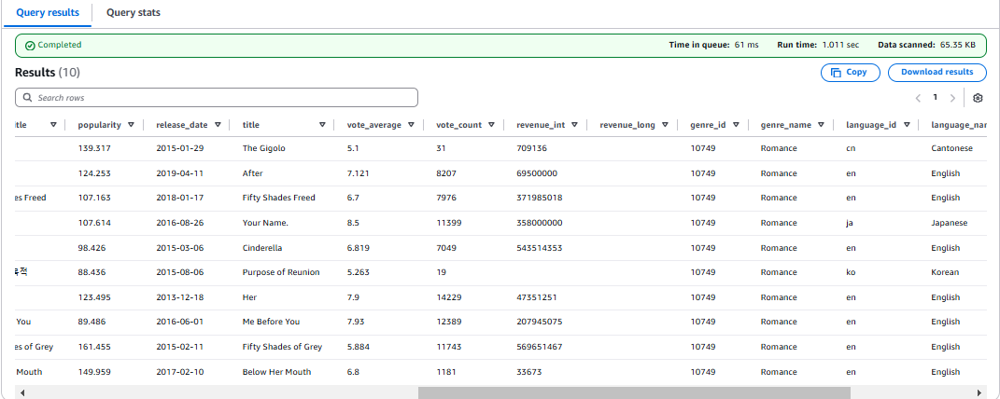

# **Dificuldades**

Devido à insuficiência dos dados apresentados na primeira tentativa do desafio e já utilizando o AWS Athena, tive que refazer o código usado no Lambda. Isso incluiu recriar o job, apagar diretórios e databases, além de arcar com os custos das execuções de cada job realizado. No entanto, após as adaptações e a captura de novos dados, as próximas sprints contarão com um dataset mais completo para as análises futuras.


