# **Sprint 8- Camada Trusted e Spark** 

## **O que foi feito nessa Sprint 8?**

Nessa sprint foram realizados execícios de prática usando Pyspark. O desafio consistia no refinamento dos dados provindo dos arquivos csv e json. 

## **Exercícios**

### **Geração de massas**

**Etapa 01**

Constia na geração de uma lista contendo 250 inteiros obtidos aleatoriamente , aplicando o método reverse sobre o resultado.

````python

import random

lista_numerica = [random.randint(1,1000) for i in range(250)]
lista_numerica.reverse()
print(lista_numerica)

````
**Resultado**

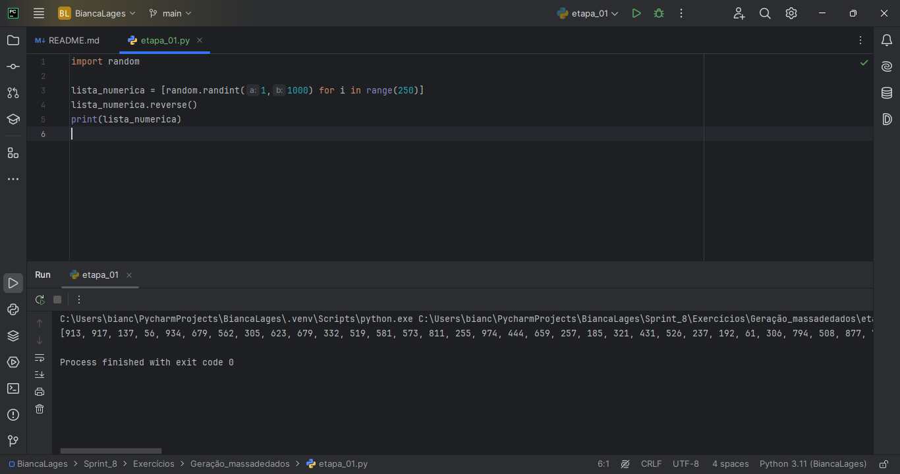

**Etapa 02**

Consistia em declarar e inicializar uma lista contendo o nome de 20 animais , por ordem crescente aramazenando os dados em um arquivo txt , no formato CSV.

````python

import random

animais = ['cachorro','gato','elefante','girafa','leão','tigre','macaco','panda','coelho','rato'
           'cavalo','vaca','ovelha','porco','galinha','pato','peixe','pássaro','cabra','jacaré']

random.shuffle(animais)
animais.sort()
for animal in animais:
    print(animal)

with open('animais.csv','w') as arquivos:
    for animal in animais:
        arquivos.write(f'{animal}\n')

````
**Resultado**

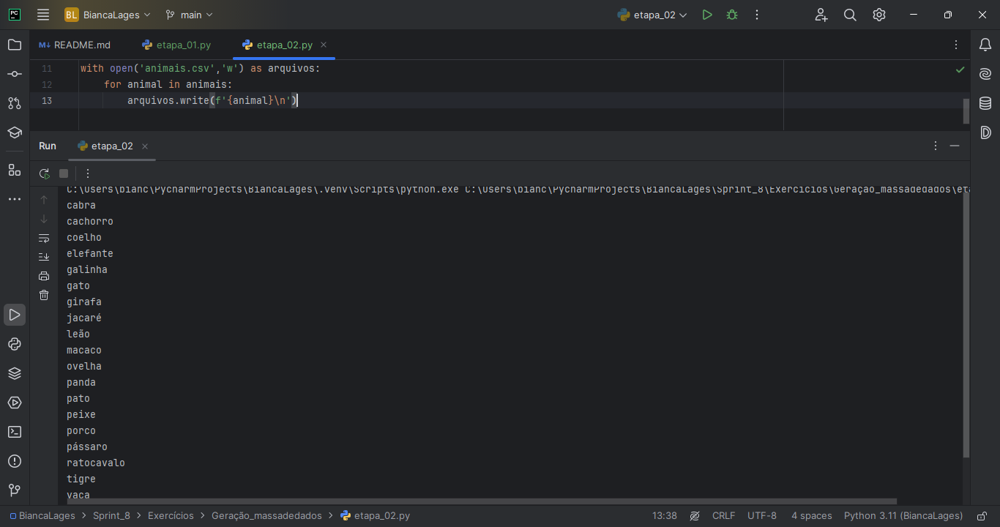

**Etapa 03**

Consistia na criação de um scrpit Python para gerar um dataset de nome de pessoas aleatoriamente , armazenando em um arquivo txt.

````python

import names
import random
import os
import time
````
As bibliotecas que foram usandas , além da bibliotecas pedida nomes.

````python

random.seed(40)

qtd_nomes_unicos = 3000
qtd_nomes_aleatorios = 10000000
````
Parâmetros para a geração do dataset.

````python
aux = []
for i in range(0, qtd_nomes_unicos):
    aux.append(names.get_full_name())
print(f"Gerando {qtd_nomes_aleatorios} nomes aleatorios".format(qtd_nomes_aleatorios))

dados = []
for i in range(0, qtd_nomes_aleatorios):
    dados.append(random.choice(aux))
````
Geração dos nomes aleatórios e a contagem dessas.

````python

output_file = "nomes_aleatorios.txt"
with open(output_file, "w",encoding='utf-8') as arquivo:
    for nome in dados:
        arquivo.write(nome + '\n')

print(f'Arquivo {output_file} criado com sucesso!')

````
O lançamento dos dados gerados em um arquivo txt chamado nomes_aleatorios.

**Resultado**

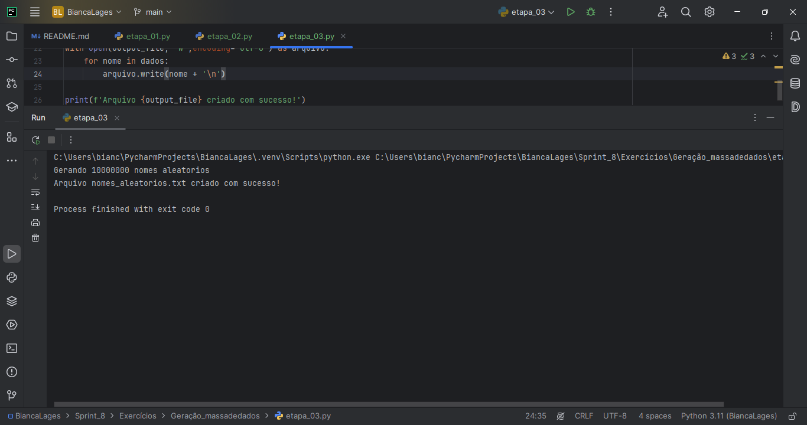

### **Apache Spark**

Usando o arquivo gerado do exercício Geração de Massa de dados para executar uma série de dataframes usando o pyspark.

````python
from pyspark.sql import SparkSession
from pyspark import SparkContext, SQLContext
from pyspark.sql.functions import col,lit,rand,when
````
As bibliotecas usadas para executação das etapas.

````python

spark = SparkSession \
         .builder \
         .master("local[*]")\
         .appName("Exercício Intro") \
         .getOrCreate()
````
Iniciando a sessão Spark

**Etapa 01**

Leitura do arquivo nomes_aleatorios.txt usando pyspark e o carregando para o dataframe df_nomes e mostrando os 5 primeiros resultados.

````python

df_nomes = spark.read.csv("C:\\Users\\bianc\\PycharmProjects\\BiancaLages\\Sprint_8\\Exercícios\\Apache_Spark\\nomes_aleatorios.txt", header=False, inferSchema=True)
df_nomes.show(10)

````
**Resultado**

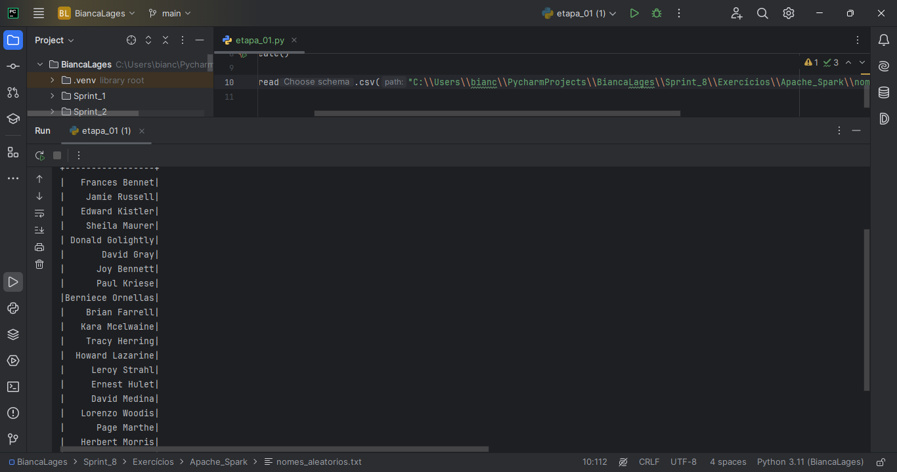

**Etapa 02**

Renomeação da coluna Nomes e mostrando as 10 primeiras linhas 

````python
df_nomes = df_nomes.withColumnRenamed('_c0','Nomes')
df_nomes.show(10)
````
**Resultado**

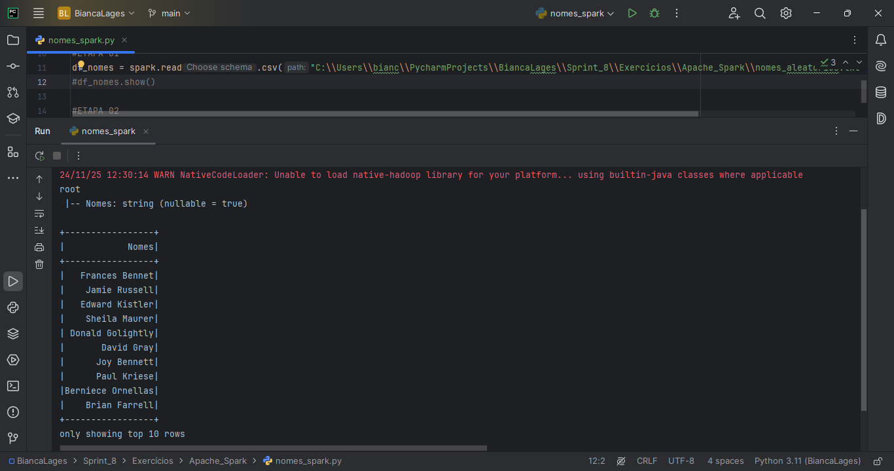

**Etapa 03**

Adição da coluna Escolaridade ao dataframe df_nomes, atribuindo aleatoriamente três valores : Fundamental, Médio ou Superior.

````python
df_nomes = df_nomes.withColumn(
    "Escolaridade",
    when(rand() <= 0.33, lit("Fundamental"))
    .when((rand() > 0.33) & (rand() <= 0.66), lit("Médio"))
    .otherwise(lit("Superior"))
)
df_nomes.show(10)

````
**Resultado**

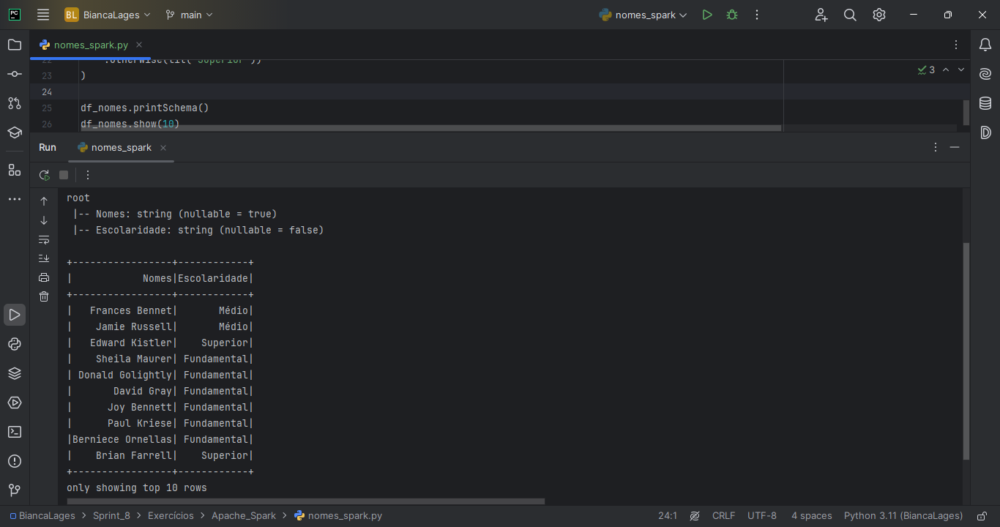

**Etapa 04**

Adição da coluna Pais ao dataframe df_nomes, atribuindo aleatoriamente um dos 13 paises da América do Sul.

````python

paises_sul_america = ["Brasil", "Argentina", "Bolívia", "Chile", "Colômbia", "Equador",
                      "Guiana", "Paraguai", "Peru", "Suriname", "Uruguai", "Venezuela"]

df_nomes = df_nomes.withColumn(
    "Pais",
    when(rand() <= 1/13, lit("Brasil"))
    .when(rand() <= 1/13, lit("Argentina"))
    .when(rand() <= 1/13, lit("Bolivia"))
    .when(rand() <= 1/13, lit("Chile"))
    .when(rand() <= 1/13, lit("Colombia"))
    .when(rand() <= 1/13, lit("Equador"))
    .when(rand() <= 1/13, lit("Guiana"))
    .when(rand() <= 1/13, lit("Paraguai"))
    .when(rand() <= 1/13, lit("Peru"))
    .when(rand() <= 1/13, lit("Suriname"))
    .when(rand() <= 1/13, lit("Uruguai"))
    .when(rand() <= 1/13, lit("Venezuela"))
    .otherwise(lit("Venezuela"))

)
df_nomes.show(10)
````
**Resultado**

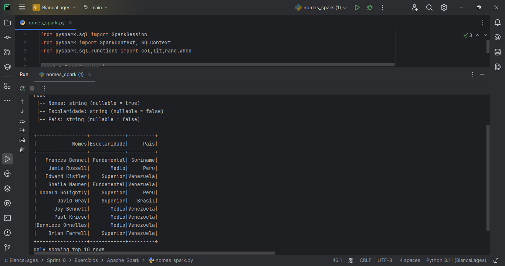

**Etapa 05**

Adição da coluna chamada AnoNascimento ao dataframe df_nomes, variando entre 1945 e 2010 de forma alaetória.

````python
df_nomes = df_nomes.withColumn("AnoNascimento", (rand() * 65 + 1945).cast("int"))
df_nomes.show(10)

````
**Resultado**

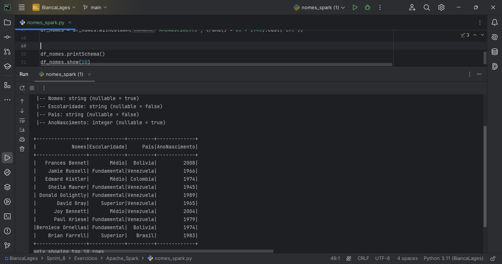

**Etapa 06**

Usando o metodo select do dataframe (df_nomes), selecione as pessoas de nasceram neste século, aramazenando em outro dataframe (df_select)

````python
df_select = df_nomes.filter(col("AnoNascimento") >= 2001)
df_select.select("Nomes").show(10)
````
**Resultado**

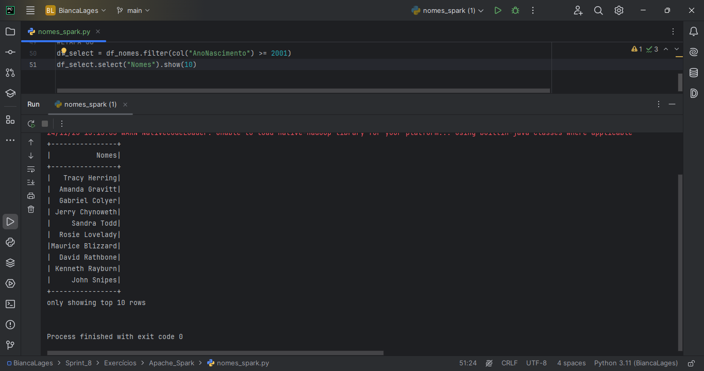

**Etapa 07**

Usando o Spark SQL repita o processo da etapa 06.

````python

df_nomes.createOrReplaceTempView("pessoas")
spark.sql("select * from pessoas").show()
spark.sql("select * from pessoas where AnoNascimento >= 2001").show()
````
**Resultado**


**Etapa 08**

Usando o método filter do dataframe df_nomes , conte o número de pessoas da geração Millennials no dataset.
````python
millennials = df_nomes.filter((col("AnoNascimento") >= 1980) &(col("AnoNascimento") <= 1994))
num_millenials = millennials.count()
print("Número de Millennials: ", num_millenials)
````
**Resultado**

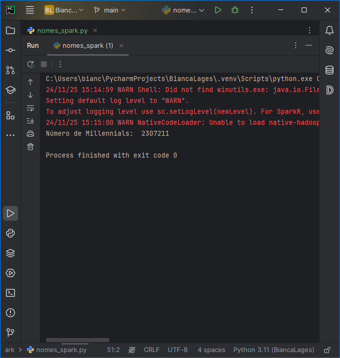

**Etapa 09**

Repitir o processo da etapa 08 usando SparK SQL.

````python
resultado = spark.sql("""
    select count(*) as num_millenials
    from pessoas
    where AnoNascimento BETWEEN 1980 and 1994
""")
resultado.show()
````
**Resultado**

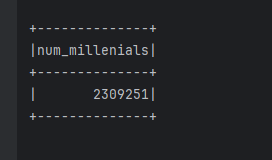

**Etapa 10**

Usando o Spark SQL, obtenha a contagem das pessoas das geraçôes: Baby Boomers, Geração X, Millennials, Geração Z do dataframe.

````python
resposta = spark.sql("""
    select
        Pais,
        case
            when AnoNaScimento BETWEEN 1944 AND 1964 THEN "Baby Boomers"
            when AnoNascimento BETWEEN 1965 AND 1979 THEN "Geração X"
            when AnoNascimento BETWEEN 1980 AND 1994 THEN "Millenials"
            when AnoNascimento BETWEEN 1995 AND 2015 THEN "Geração Z"
            else "Outras Gerações"
        end as geracao,
        count(*) as quantidade
    from pessoas
    group by Pais, geracao
    order by Pais, geracao , quantidade
""")
resposta.show()
````
**Resultado**

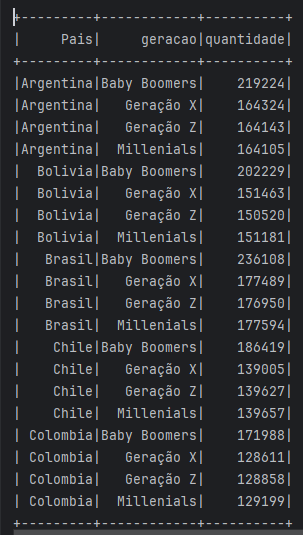

### **TMDB**

Esse exercício foi realizado na sprint passada, aqui está o resultado.

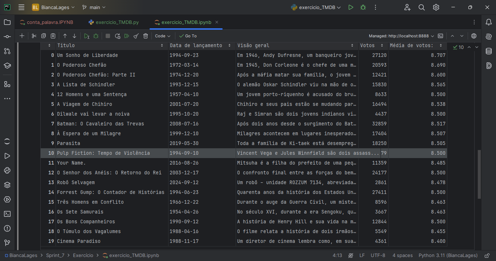

## **Desafio**

Aqui está os arquivos parquet gerados no run job usando a AWS GLUE e a tabela do AWS Athena.

**CSV**


**JSON**


**Tabela AWS Athena**


# **Comentário**

Nessa sprint gostei da prática do serviço do AWS Glue e do Pyspark, o desafio acabou dando mais problemas no script do job do que nos exercícios pyspark. 