# **Sprint 9- Modelagem Dimensional e Camada Refined**

## **Sobre o Desafio:**

O desafio pede à modelagem multidimensional dos dados existentes na Camada Trusted, a criação de tabelas seguindo a modelagem feita, diponíveis na Refined Zone em formato PARQUET. Aplicando os Apache Spark no Job dentro da AWS Glue e as tabelas modeladas acessíveis via AWS Athena.

## **AWS GLUE**

### **União**

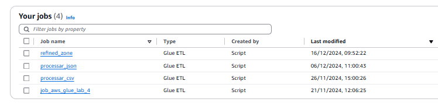

A primeira etapa do desafio consistia na união das dados existentes da Camada Trusted, dados esses tratados provindos do arquivo csv "movies.csv" e dos json da pesquisa realizada no TMDB.

````python
from pyspark.sql.functions import col, to_date, split, explode, year, month, dayofmonth, row_number, array_contains
from pyspark.sql.window import Window
from datetime import datetime
from awsglue.dynamicframe import DynamicFrame
````

As bibliotecas importadas para uso do DynamicFrame para leitura dos dados, pyspark para montagem das tabelas e tratamento de dados. 

````python
csv_path = "s3://datalake.biancalages/TRUSTED/CSV/2024/11/26/"
json_path = "s3://datalake.biancalages/TRUSTED/JSON/2024/12/06/"
````
O path dos arquivos parquet da Camada Trusted dentro do bucket "datalake.biancalages".

````python
dyf_csv = glueContext.create_dynamic_frame.from_options(
    connection_type="s3",
    connection_options={"paths": [csv_path]},
    format="parquet"
)

print("Lendo dados JSON da Trusted Zone")
dyf_json = glueContext.create_dynamic_frame.from_options(
    connection_type="s3",
    connection_options={"paths": [json_path]},
    format="parquet"
)
````
A leitura dos parquet de origem usando DynamicFrame. 

````python
# Converter DynamicFrames para DataFrames
df_csv = dyf_csv.toDF()
df_json = dyf_json.toDF()
````
Conversão de DynamicFrame para Dataframe.

````python
# Transformação dados CSV
df_csv = df_csv.withColumn("notamedia", col("notamedia").cast("float")) \
               .withColumn("anolancamento", col("anolancamento").cast("int")) \
               .withColumn("tempominutos", col("tempominutos").cast("int")) \
               .withColumn("numerovotos", col("numerovotos").cast("int")) \
               .withColumn("genero", split(col("genero"), ",").cast("array<string>"))
````
As transformações dos dados vindo do CSV, a coluna genero vem como uma lista (array string) então tentei lidar como isso.

````python
df_json = df_json.withColumn("release_date", to_date(col("release_date"), "yyyy-MM-dd")) \
                 .withColumnRenamed("id", "json_id") \
                 .withColumnRenamed("name", "json_name")

df_json = df_json.select("json_id", "json_name", "iso_3166_1", "english_name", "language_id", "backdrop_path",
                         "budget", "imdb_id", "original_language", "original_title", "popularity", "release_date",
                         "title", "vote_average", "vote_count", "revenue_int", "revenue_long", "genre_id", "genre_name",
                         "language_name")
````
As transformações dos dados provindos do JSON, renomeando colunas para evitar conflitos durante a união e selecionando todas as colunas necessárias.

````python
df_comum = df_csv.join(df_json, df_csv["titulopincipal"] == df_json["title"], "inner")
````
A união entre os DataFrame foi baseadan nas colunas titulo Principal do df_csv e title do df_json. Criando o Dataframe df_comum contendo os filmes em comum dos dois dataframes, dando prioridade para os filmes do csv e complementando com as dados do json.

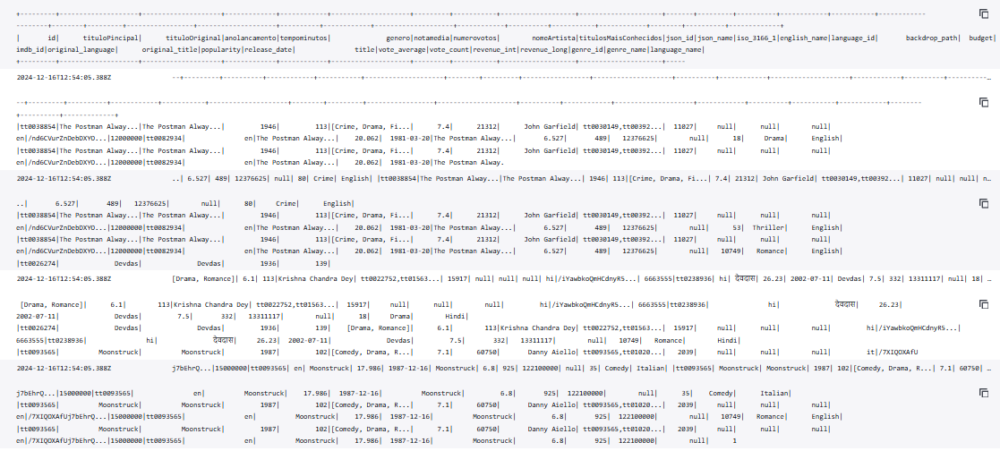
*print retirado via AWS CLOUDWATCH*

### **MODELAGEM DIMENSIONAL**

A projeção dos dados do dataframe resultou nas seguintes tabelas.

**DIMENSÃO GÊNERO**

````python
df_generos = df_comum.select("id", explode(col("genero")).alias("genero"))

# Criar DataFrame com gêneros distintos
df_generos_distinct = df_generos.select("genero").distinct()

# Adicionar coluna de ID para cada gênero encontrado
windowSpecGenero = Window.orderBy("genero")
df_generos_id = df_generos_distinct.withColumn("genre_id", row_number().over(windowSpecGenero))

# Mostrar o DataFrame resultante
df_generos_id.show()
````
A coluna "genero" vindo do df_comum, contem os nomes dos generos dos filmes do dataframe, uma string, pegando os distintos destes e usando o windowspec para criar um id unico para cada genero distinto encontrado no dataframe. Assim, criando a dimensão gênero com o genero e genre_id.

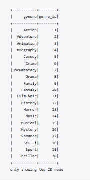
*print retirado via AWS CLOUDWATCH*

**DIMENSÃO IDIOMA**

````python
# Criar DataFrame de idiomas com colunas originais e idioma distinto
df_idioma = df_comum.select(
    col("language_id").alias("sigla_language"),
    col("language_name")
).distinct()

# Adicionar coluna de ID para cada idioma
windowSpecIdioma = Window.orderBy("language_name")
df_idioma = df_idioma.withColumn("id_language", row_number().over(windowSpecIdioma))

# Exibir o DataFrame resultante
df_idioma.show()
````
As colunas "language_id" e "language_name" contém os dados de idioma dos filmes presentes no dataframa. A coluna language_id foi renomeada para sigla_language, os dados consistiam nas sigla do idioma como: en,sh. Foi usado o windowspec para criar um id para cada idioma distinto encontrado. Assim, criando a dimensão idioma com o id_idioma, sigla_language, language_name.

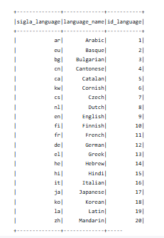
*print retirado via AWS CLOUDWATCH*

**DIMENSÃO TEMPO**

````python
# Selecionar a coluna release_date do df_comum e remover duplicatas
df_tempo = df_comum.select("release_date").distinct()

# Adicionar colunas de ano, mês e dia extraídas de release_date
df_tempo = df_tempo.withColumn("ano", year(col("release_date"))) \
                   .withColumn("mes", month(col("release_date"))) \
                   .withColumn("dia", dayofmonth(col("release_date")))

# Adicionar coluna de id_tempo auto-incrementada
windowSpecTempo = Window.orderBy("release_date")
df_tempo = df_tempo.withColumn("id_tempo", row_number().over(windowSpecTempo))
````
A coluna "release_date" do dataframe df_comum, foram extraídos o ano, mês e dia de cada filme do dataframe, usando o windowspec um id para cada data distinta. Assim, temos a dimensão tempo com release-date, ano, mês e dia e id_tempo.

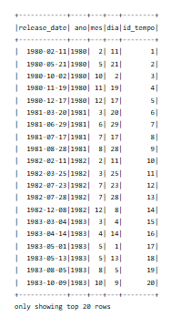
*print retirado do CLOUDWATCH*

**DIMENSÃO FILMES**

````python
# Selecionar e renomear colunas do df_comum
df_filmes_base = df_comum.select(
    col("id").alias("id_filmes"),
    col("titulopincipal").alias("tituloprincipal"),
    col("tituloOriginal"),
    col("budget"),
    col("tempominutos"),
    col("vote_average"),
    col("vote_count"),
    col("revenue_int"),
    col("popularity"),
    col("release_date"),
    col("language_id")
)

# Juntar com df_tempo para obter id_tempo
df_filmes_with_tempo = df_filmes_base.join(
    df_tempo.select("release_date", "id_tempo"),
    on="release_date",
    how="left"
)

# Juntar com df_idioma para obter silga_language
df_filmes = df_filmes_with_tempo.join(
    df_idioma,
    df_filmes_with_tempo["language_id"] == df_idioma["sigla_language"],
    how="left"
).drop(df_idioma["sigla_language"])

df_filmes = df_filmes.withColumn("lucro", col("revenue_int") - col("budget"))

# Selecionar as colunas finais
df_filmes = df_filmes.select(
    col("id_filmes"),
    col("tituloprincipal"),
    col("tituloOriginal"),
    col("budget"),
     col("revenue_int"),
    col("tempominutos"),
    col("vote_average"),
    col("vote_count"),
    col("popularity"),
    col("lucro"),
    col("id_tempo"),
    col("id_language")
)

#Removendo as duplicadas
df_filmes = df_filmes.dropDuplicates(["tituloprincipal"])

# Exibir o DataFrame resultante
df_filmes.show()
````
As colunas "id_filmes", "tituloprincipal", "titulooriginal", "tempominutos" vieram do df_csv, as colunas "budget", "revenue_int", "vote_average", "popularity" oriundas do df_json, porém todos esses dados estão contidos no df_comum, selecionando essas colunas e adicionando o id_tempo da dimensão tempo , id_language da dimensão idioma, por filme respectivamente. Foi removidos os dados duplicados usando a coluna tituloprincipal para unificação dos dados da dimensão. Assim, criando a dimensão filmes.

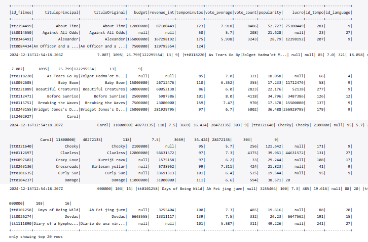
*print retirado via AWS CLOUDWATCH*

**RELACIONAL FILME_GENEROS**

````python
# Explodir a coluna genero em df_comum para criar linhas individuais para cada gênero
df_filmes_genero_base = df_comum.select(
    col("id").alias("id_filmes"),
    explode(col("genero")).alias("genero")
)

# Unir com a tabela de gêneros para obter genre_id
df_filmes_genero = df_filmes_genero_base.join(
    df_generos_id,
    on="genero",
    how="left"
).select(
    col("id_filmes"),
    col("genre_id")
)

# Remover duplicatas para garantir um relacionamento de um para muitos
df_filme_generos = df_filmes_genero.dropDuplicates()

# Exibir o DataFrame resultante
df_filme_generos.show()
````
A criação da dimensão do relacionamento um para muitos entre filme e generos, deu-se pois uma das analises, será nescessario a distinção por generos dos filmes e com essa dimensão possui o id_filmes do filmes e genre_id de cada genero em linhas separadas. Removendo as duplicadas para garantir um relacionamento de um para muitos.

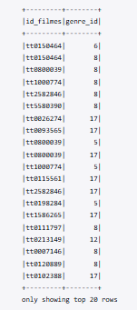
*print retirado via AWS CLOUDWATCH*

## **DIAGRAMA DIMENSIONAL**

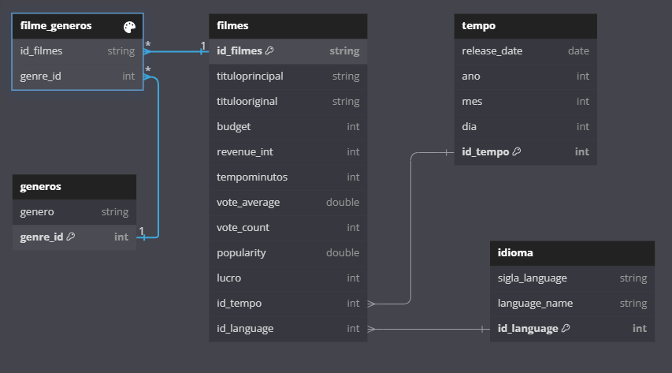

## **BUCKET**

````python
# Converter DataFrames para DynamicFrames
dyf_comum = DynamicFrame.fromDF(df_comum, glueContext, "dyf_union")
dyf_tempo = DynamicFrame.fromDF(df_tempo, glueContext, "dyf_tempo")
dyf_filmes = DynamicFrame.fromDF(df_filmes, glueContext, "dyf_filmes")
dyf_idioma = DynamicFrame.fromDF(df_idioma, glueContext, "dyf_idioma")
dyf_genero = DynamicFrame.fromDF(df_generos_id, glueContext, "dyf_genero")
dyf_filme_generos = DynamicFrame.fromDF(df_filme_generos, glueContext, "dyf_filme_generos")
````
Todos os dataframes criados sendo transformados em dynamicframe novamente, para a criação dos arquivos em formato parquet de cada dimensão .

````python
# Caminho de saída na Refined Zone com pastas para cada tabela e depois o dia de processamento
refined_path = "s3://datalake.biancalages/REFINED/MRD/"
year = datetime.now().strftime('%Y')
month = datetime.now().strftime('%m')
day = datetime.now().strftime('%d')

glueContext.write_dynamic_frame.from_options(
    frame=dyf_comum,
    connection_type="s3",
    connection_options={"path": f"s3://datalake.biancalages/UNION/PARQUET/{year}/{month}/{day}/"},
    format="parquet"
)

glueContext.write_dynamic_frame.from_options(
    frame=dyf_tempo,
    connection_type="s3",
    connection_options={"path": f"{refined_path}TEMPO/{year}/{month}/{day}/"},
    format="parquet"
)
````
Mandamos os dados modelados em formato parquet para o bucket dentro um diretório chamado refined, a união por questão de organização foi feita um diretório chamado union contendo o dataframe df_comum. Usando o path bucket/union/parquet para os parquet dos dataframe df_comum, bucket/refined/mdr/dimensão/ano/mes/dia para os parquet dos dados modelados.

**DIRETÓRIO UNION**

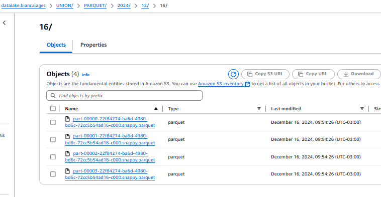

**DIRETÓRIO DAS DIMENSÕES**

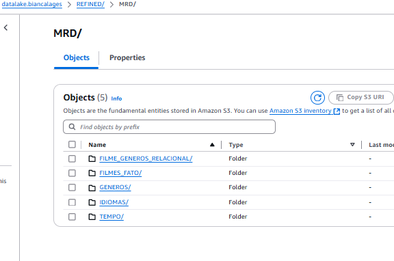

**PARQUET DAS DIMENSÕES**

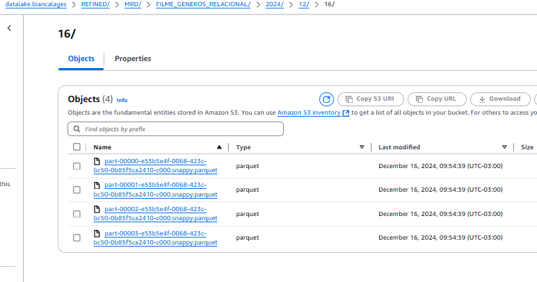

# **Comentário sobre a sprint**

Nessa sprint gostei de relembrar dos conhecimentos da sprint 03, teve uma certa dificuldade pois tive refazer varias vezes até que os dados na visualização na AWS Athena estivessem da forma que eu queria, mas com a ajuda do componentes da minha squad e o monitor consegui finalizar o desafio.


