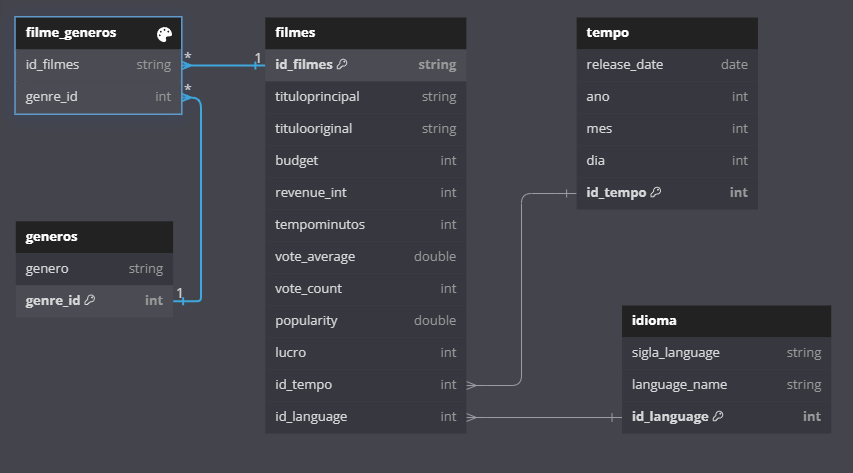
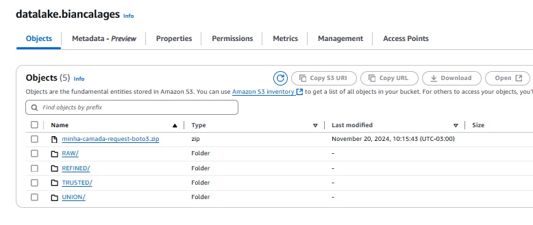
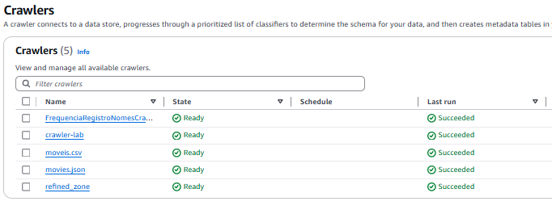
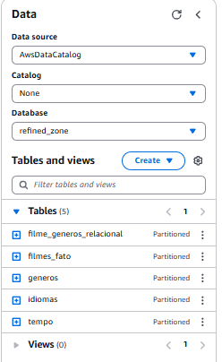

# **Sprint 9- Modelagem Dimensional e Camada Refined** 

## **O que foi feito nessa Sprint 9?**

Nessa sprint não houveram exercícios e cursos, o foco desta era a modelagem dos dados para a preparar da visualização no AWS Quicksite.

### **Modelagem Dimensional**

Este modelo é um esquema estrela, com a tabela fato (filmes) centralizada e conectada diretamente a várias tabelas dimensionais (generos,idioma,tempo). A tabela filme_generos representa a relação muitos-para-muitos , significando que um filmes pode pertencer a múltiplos gêneros e um gênero pode estar associado a múltiplos filmes. 

### **Bucket**

### **Crawler**

Foi feito um crawler dos dados dimensionados da camada refined, para a visualização dentro do AWS Athena.

### **AWS Athena**

# **Comentário**
Nessa sprint gostei de relembrar dos conhecimentos da sprint 03, teve uma certa dificuldade pois tive refazer varias vezes até que os dados na visualização na AWS Athena estivessem da forma que eu queria, mas com a ajuda do componentes da minha squad e o monitor consegui finalizar o desafio.